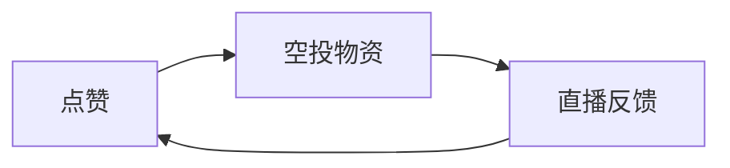

# 创意汇总

作者 u9king/Rundong Wang

#### 1.直播荒岛求生游戏

核心游戏循环：点赞 —> 空投物资 —> 直播反馈 ↺

$$
\mathbf{\Large 事件灵感收集}\\
\underline{\hspace{10cm}} \\
\begin{array}{ccc}
1. 飞蚊 & 2. 暴雨 & 3. 意外受伤 \\
4. 中暑 & 5. 采集食物（莲藕） & 6.生火 \\
7. 钓鱼 & 8. 漂浮物 & 9.意外空投 \\
10. 回忆 & 11. 商人 &
\end{array}
$$
