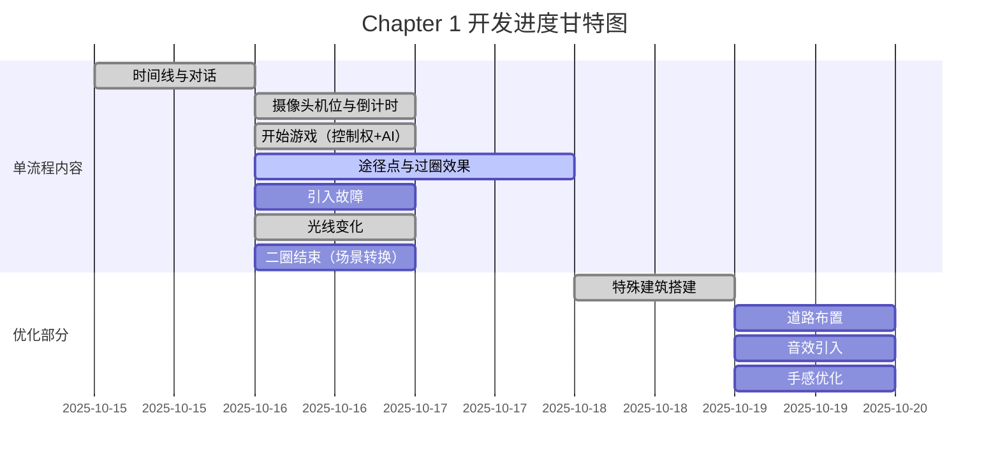

# 故障赛道Glitch Racer—TapTap21全程参与奖

[TOC]

#### 1.参与条件

- [ ] 上传了游戏 demo
    - [ ] 体验：`目标：明确的努力方向，且在完成目标后能获得快感，或在此过程中能学习到知识`
    - [ ] 玩法：`规则：玩家在完成目标的过程中，规定玩家可以做什么不可以做什么的约束性设计。`
    - [ ] 关卡：`挑战：通过玩法、规则、关卡设计等形成的，让玩家无法直接达成目标的有形或无形障碍。`
    - [ ] 体验2：`反馈：玩家在体验过程中，能通过操作、决策来让游戏产生变化，塑造游戏的进程和结果。`
- [ ] 发布6篇以上（包含6篇）的开发者日志


巨物崇拜QTE 其中6个 中4个就行

G型轨道每段2个


聚焦五款入选作品，展示独立开发者在塔防领域的创意与突破。

#### 2.开发日志内容

|                               |      |
| :---------------------------: | ---- |
|     这是一款什么样的游戏      |      |
|     某个灵感的乍现和落地      |      |
|     开发的过程 vlog/plog      |      |
| 和本次赛事游戏/团队相关的趣闻 |      |
|                               |      |
|                               |      |
|                               |      |

#### 3.进度

Chapter1

- [ ] 单流程内容
    - [x] 时间线
        - [x] 对话
        - [x] 摄像头机位
        - [x] 倒计时
    - [x] 开始游戏
        - [x] 给予控制权
        - [x] AI开始行使
    - [x] 途径点
        - [x] 过圈效果
            - [x] 对话
            - [ ] 引入故障
            - [x] 光线变化
    - [ ] 二圈结束
        - [ ] 转换场景
    - [ ] 优化部分
        - [ ] 场景搭建
            - [x] 特殊建筑
            - [ ] 道路布置
        - [ ] 音效引入
        - [ ] 优化手感

Chapter2

- [ ] 单流程
    - [ ] 赛道
    - [ ] 遮挡
    - [ ] AI
- [ ] 时间线
    - [ ] 对话
    - [ ] 摄像头机位
    - [ ] 倒计时

#### 4.甘特图




$$
gantt
    title Chapter 1 开发进度甘特图
    dateFormat  YYYY-MM-DD
    axisFormat  %m/%d
    section 单流程内容
    时间线与对话          :done,    t1, 2025-10-15, 1d
    摄像头机位与倒计时    :done,    t2, after t1, 1d
    开始游戏（控制权+AI） :done,    t3, after t2, 1d
    途径点与过圈效果      :active,  t4, after t3, 2d
    引入故障              :todo,    t5, after t4, 1d
    光线变化              :done,    t6, after t4, 0.5d
    二圈结束（场景转换）  :todo,    t7, after t5, 1d

    section 优化部分
    特殊建筑搭建          :done,    o1, 2025-10-18, 1d
    道路布置              :todo,    o2, after o1, 1d
    音效引入              :todo,    o3, after o2, 1d
    手感优化              :todo,    o4, after o3, 1d
$$


#### 3.难点

- [ ] 赛车系统
    - [x] 操控
        - [x] 基本控制
        - [ ] 操控优化
    - [ ] 途经点
    - [x] 小地图
    - [ ] 场景搭建
    - [ ] 圈数
    - [x] 音效
- [ ] 人物锤击系统
    - [ ] 基本功能
    - [ ] 锤击手感优化
- [ ] 剧情系统
    - [ ] 对话
    - [x] 剧情文本
- [ ] 菜单系统
    - [ ] 设置菜单


#### 5.链接

```
参赛主题：https://www.taptap.cn/poster/NG8RxAR07p00
开发日志写法:https://www.taptap.cn/moment/580820744309575140
设置官方人员:https://www.taptap.cn/moment/580820744309575140
后台投稿按钮异常状况:https://www.taptap.cn/moment/727229362218209052


开发日志模仿链接：
1.https://www.taptap.cn/moment/15215133340994212
2.https://www.taptap.cn/moment/17012549404852470
3.https://www.taptap.cn/moment/15221335131164207
4.https://www.taptap.cn/moment/15224175337671149


```

#### 6.开发日志

【开发日志 #01】脑暴BUG题目

```
>> 脑暴环节
忙活了大半周才想起来要写开发日志，虽然是Solo也可以谈一谈自己的见解。
首先BUG这个题目其实并不友好，虽然游戏行业大多知道BUG是什么，但是这是一个非常程序的概念，也就是说出生于各行各业的玩家其实可能并不清楚什么是BUG，就比如快消行业的朋友可能一辈子也未必能接触到BUG这个词，所以很可能会把他理解为电脑坏了，或者电脑出问题了之类的等等。
BUG这个词也是有出处，1947年霍珀去维修电脑，发现导致电脑故障是一只飞蛾，BUG这个词就此诞生。所以BUG也有小虫的意思。往后更多的是将他解释为一种会导致程序崩溃的错误。
对于上次GMTK的作品中涉及开车的部分，我也不是很满意，所以就决定重新学习一些赛车游戏的知识，用赛车游戏的方法来演绎BUG，或者说故障。那作品名就叫作故障赛道《Glitch Racer》。
>> 初步设计
由于单人参赛上次已经吃过亏，不能设计的太大，就采用三段式设计，设计三个关卡，每个关卡用来展现一种BUG的表达形式。
初步设想是第一关采用故障的shader来改变开车时的画面，在很多游戏中也会用到这个shader。类似绝区零。这是比较表象的BUG显现形式，玩家在开的时候，遇到某些区域会有画面故障，导致行使起来没有那么自如。
第二关可能会采用穿越的手法到一个昆虫的世界。虽说在场景上会多花不少力气，但是好在游戏机制不需要动太多。也能够很好的凸显出BUG这个出题。
第三关感觉会考虑从机制上体现BUG，现在设想是玩家穿越到Boss或者赛道上的障碍物这里，玩家从开车的人转变为破坏赛车的人，然后从剧情的角度去推进玩家理解BUG，然后破坏一定的车辆最后通关。
既然是赛车游戏埋一点小的meta也是可以的，赛车地图到就采用B型，U型和G型吧。不知道玩家会不会发现，嘻嘻，前提是G型关卡最后能做完。
```

【开发日志 #02】搭建赛车游戏框架

```
>> 游戏进展
初步搭建了赛车系统，虽然操作手感还需要进一步打磨，但整体框架已经能够支撑起基础的赛车体验。在车辆模型方面，尝试了多种素材，发现很多模型在前后轮独立控制上存在局限，导致车辆动态表现不够真实。考虑到独立游戏的体量控制，应特别注意资源管理，避免过大的安装包。技术上采用了Unity内置的车轮碰撞器。这个组件提供了丰富的参数调节，包括侧向制动力、悬挂强度和前后轮摩擦力等，为车辆调校提供了很大空间。不过目前对这个组件的理解还不够深入，需要继续学习和优化。
>> 未来计划
接下来将重点搭建完整的赛道，并布置初步的环境元素。计划先实现一个包含两圈赛程的玩法原型，在这个基础上尝试融入剧情叙事。这意味着我需要同步开发剧情系统、开场动画，以及完善场景搭建。虽然工作量不小，但项目正在稳步推进。
>> 项目风险
目前第三关的Boss战设计遇到了一些困难，特别是在角色翻转动画的表现上。由于技术限制，我们正在考虑采用机关解谜或点击触发的简化方案。作为游戏的高潮部分，这一关需要更多的动画演出和剧情表现，需要我们投入更多精力来打磨。
```

【开发日志 #03】多赛车道路实装

```
>> 游戏进展
大家好，这次带来《Glitch Racer》的第三篇开发日志！
这一阶段最大的进展是：第一关的赛道终于能完整跑起来了！
赛道是通过Unity的曲线工具制作的，目前的版本是一个B型赛道。
我在其中加入了几个 AI 对手，他们现在还不太聪明——有时候会撞墙、也会乱开——但至少不再是孤单地一个人绕圈。
为了让画面更有赛博感，我在场景里摆放了一些霓虹风格的建筑和灯光元素。整个城市开始“亮起来”了。现在一开场，就能感受到那种速度与噪点并存的感觉。
当你冲过终点线时，游戏会带你进入全新的第二关。
>> 下一步计划
接下来，我会开始搭建第二关的内容。
如果说第一关是“赛博城市的表象”，那么第二关就是进入系统内部的虫世界。这部分会通过“场景的崩坏和变形”来表达“BUG”的主题。
这一关对我来说挑战很大，因为要搭建全新的环境，还要做出一种既诡异又好看的氛围感。不过这是我最期待的一部分，也希望能在视觉上让大家有一种“游戏自己坏掉了”的错觉。
>> 一些心里话
虽然第一关的基础已经完成，但我很清楚玩家不一定会按照我的想法去玩。
我也不打算去限制玩家的行为。
我更希望大家能在自己的节奏中，找到属于自己的乐趣。
对我来说，游戏开发就像在做梦。
有些地方不完美，有些地方甚至会出BUG，但正是这些“错误”，让它变得更有生命力。
```