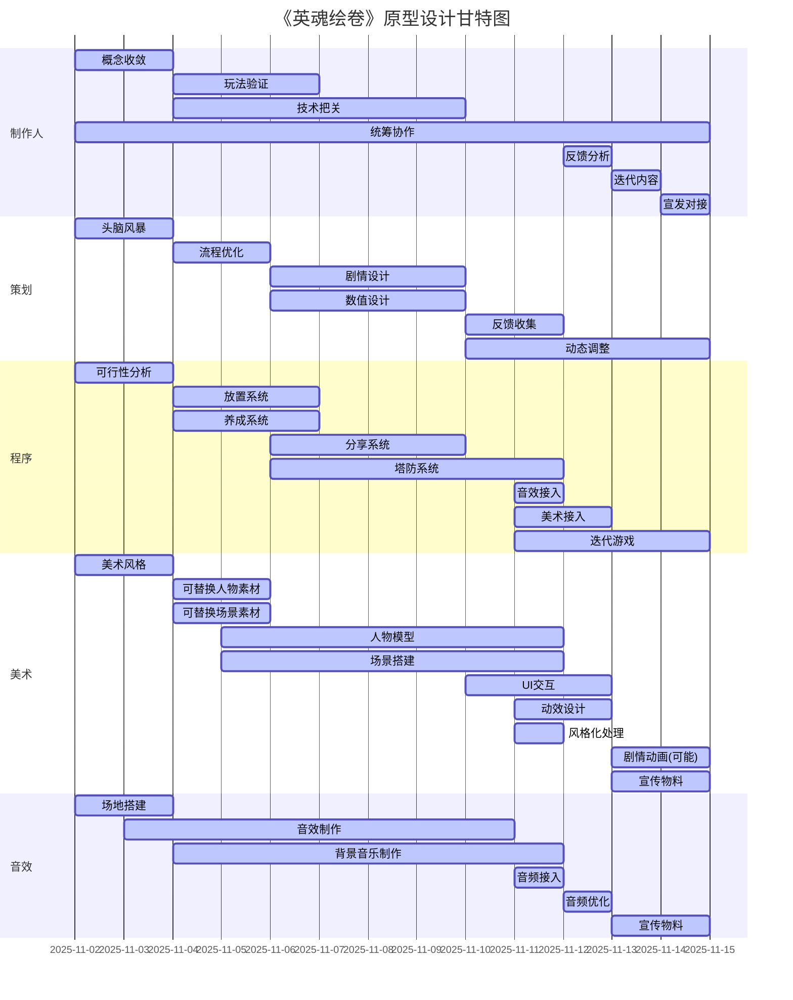

# 英魂绘卷 —— 虚拟战士手办柜

### 1.玩家需求

​	作为游戏制作人，根据虚拟战士手办柜这个主题，我倾向设计一款放置类塔防游戏，取名为《英魂绘卷》。

​	战士一词表明人物是具有战斗能力或战斗背景故事，因此游戏自然适合以战斗内容为核心；而手办柜则强调展示空间。与传统手办柜相比，**虚拟**手办柜具有更强的交互性，所以手办角色应该能进行互动和战斗。

​	《英魂绘卷》将以放置+基地养成+塔防这三种机制构建完整的游戏循环：放置和基地养成为玩家提供拥有感和养成体验，塔防则展示养成成果，同时增强欣赏性体验。未来可进一步加入轻量社交系统，例如英魂展示或游戏工坊，以突出养成后的内容和玩家创造性表达。

|  |  |
| :----------------------------------------------------------: | :----------------------------------------------------------: |
|  |  |

#### 1.1 玩家体验

在《英魂绘卷》中，玩家通过基地放置养成的方式，与虚拟手办的轻交互来积累资源、提升属性，通过长时间陪伴来建立更深的投入感和情感联系。再通过塔防战斗来展示养成成果与战士形象，实现从收藏 → 培育 → 战斗→ 展示的完整体验闭环。

这款游戏希望带给玩家一种**可触摸的养成**体验：

- 玩家能亲手建设与布置自己的手办柜基地/空间，看到自己的收藏在空间中生长；
- 通过塔防战斗，看到自己养成的成果在战场上发光。
- 将战斗成果在社交系统中进行展示得到互动反馈。

相比传统的静态手办收藏，《英魂绘卷》的虚拟战士手办柜不再是一个被动展示的空间，而是一座能动、能成长、能战斗的活体收藏世界。

#### 1.2 深层需求

《英魂绘卷》的核心体验对应三种关键心理诉求：

| 体验维度 |    玩家核心动机    |                         具体满足方式                         |
| :------: | :----------------: | :----------------------------------------------------------: |
|   欣赏   | 视觉与情感上的愉悦 | 在展示柜中观察战士的外观、动作与背景故事，并通过塔防战斗来感受英魂手办的原生气魄 |
|   拥有   |    独特收藏标志    | 通过战士收集与个性化定制，形成属于自己的英魂柜，获得专属感与成就感 |
|   养成   |   体验成长与陪伴   | 通过放置、修炼、防守、出征等方式培养战士，看着英魂实力与外观同步成长 |

从更深层次来看，玩家的游戏时间可能有限，更类似碎片化的体验——就像养鱼的鱼缸一样需要持续投入但不占用整块时间。因此，游戏必须兼顾碎片化玩法与放置机制，让玩家在短时段也能感受到成长与收获。从养成和拥有的角度去思考，玩家渴望的不只是获得角色，而是让角色带上自己的印记，并能在展示和战斗中被他人看到和认可。

根据这三个体验维度的需求我设计《英魂绘卷》符合：

- **低门槛高自由度**：传统养成游戏可能过于复杂或耗时，而休闲游戏又缺乏深度。玩家希望有一个易于上手但能持续探索的系统，平衡简单收集与深度养成。
- **个性化与自我表达**：在许多养成或收集类游戏中，玩家往往受限于预设角色或有限的自定义选项。玩家渴望更深度的人格化定制，使战士真正代表自己的风格和身份。例如，在《原神》或《王者荣耀》中，角色自定义程度有限，玩家可能希望更自由地设计外观、背景甚至战斗风格。
- **社交展示与认同**：玩家在社交平台上分享收藏时，往往缺乏沉浸式的展示空间。现有游戏多侧重于战斗或竞争，而忽略了“静态”展示的社交价值。玩家需要一种方式在虚拟世界中构建个人画廊，获得社区认可和互动。

#### 1.3 面向对象

基于上述分析我，我认为这款游戏的目标玩家是喜欢收集、自定义和网络社交的群体，年龄可能在15-35岁，包括核心玩家和休闲玩家。未被满足的需求根源在于传统手办的互动感和个性化不足，以及社交展示的缺失。

基于以上分析，《英魂绘卷》的目标玩家群体如下：

- **核心用户**：喜爱收集、个性化养成与策略塔防玩法的中重度玩家；

- **潜在用户**：对“数字收藏”“虚拟展示”感兴趣、热衷自我表达与社交分享的年轻玩家；

- **年龄范围**：15–35岁；

- **行为特征**：

  - 喜欢在游戏中积累与展示成果；
  - 喜爱角色外观、收藏、故事性内容；
  - 追求轻操作、高沉浸、能长期陪伴的体验。

  

```
引用参考：
1.2025年中国手办市场消费行为调查数据[https://report.iimedia.cn/repo13-0/46708.html?acPlatCode=IIMReport&acFrom=bottomDownloadBtn&iimediaId=105522]
2.2025年中国IP经济产业链图谱及投资布局分析（附产业链全景图）[https://www.askci.com/news/chanye/20251022/084100276109365925060861_5.shtml]
```

### 2.核心设计思路

如果这款游戏设计完整，它将成为一个让玩家沉迷其中的**虚拟收藏空间**。玩家会主动投入时间去**收集、养成、展示与分享**他们的战士，从而形成一个由情感、审美与社交驱动的生态系统。

成功标志：高留存率、频繁的社交分享、玩家自创内容的持续增长。
愿景：打造一座“活着的手办柜”——你养成的战士在其中修炼、呼吸、成长，并在战斗中为你守护这片小世界。

#### 2.1 核心游戏循环


放置 → 基地养成 → 塔防 → 分享

##### （1）放置——构筑与欣赏

- 玩家经营自己的手办柜空间，可种植能量晶石、布置装饰、调整灯光；
- 不同风格的战士选择不同风格的区域（比如科技系、自然系、机械系）；
- 玩家能以电影视角欣赏他们的互动（例如战士们在练习、休息、交流）。

##### （2）基地养成——战士成长与个性化

- 战士在柜子中的修炼场地提升属性；
- 玩家通过喂养、对话、任务等方式强化战士；
- 每个战士拥有独特的觉醒形态与展示动作；
- 战士会记住玩家行为，建立简单的互动与陪伴感。

##### （3）塔防——战斗元素与养成展示

- 当手办柜被虚拟入侵（如能量裂缝、数据病毒）时，玩家派出养成的战士防守；
- 战斗时镜头切换至特写视角，突出战士动作与技能特效；
- 战斗胜利后，战士返回柜中展示胜利动作，或解锁新的展示主题与装饰。

##### （4）分享——展示与社交

- 玩家可一键分享战士在柜子和战斗中的表现或者胜利画面；
- 分享至社交平台或好友柜子，实现互动与认可；
- 激励玩家持续收集和养成战士。

#### 2.2 完整游戏内容

**虚拟手办柜：情感与展示的中心**

- 采用 3D界面，可自由摆放战士、布景、灯光与姿势；
- 柜子可升级，从简易架进化为豪华展厅，强化成长层次；
- 每位战士可配置动作循环或交互事件，展现个性。

**战士养成系统：从收藏到陪伴**

- 战士不仅是模型，而是拥有故事与潜力的成长个体；
- 随养成提升外观与能力，觉醒后解锁新装、特效与语音；
- 不同战士间存在共鸣羁绊，组合上场时可触发特殊展示或战斗技能。

**社交与分享系统：让收藏变成文化**

- 玩家可访问他人的柜子、点赞留言、参与虚拟展览；
- 提供摄影模式与短视频导出功能，方便玩家在社交平台分享；
- 定期举办“主题陈列挑战”或“最佳柜主”评选，强化社区循环。

**经济与内容生态：持续驱动的收藏循环**

- 采用免费 + 内购机制，玩家可购买稀有战士或个性化装饰；
- 支持玩家制作与交易自定义皮肤、配件UGC 系统；
- 形成“玩家创作—社区传播—经济循环”的长线生态。

 **收集即乐趣，养成即成就，展示即社交。**
 让每位玩家都能在自己的柜子里，感受到陪伴的温度与收藏的仪式感。

**一句话概念：**

“让玩家像收藏手办一样收藏、养成并展示他们的虚拟战士。”

**游戏目标：**

一座属于玩家自己的「虚拟战士手办柜」——收藏即舞台，养成即情感，战斗即展示。

#### 3.关键设计要点

##### 3.1 塔防战斗展示系统 —— 手办的战斗舞台

我选择塔防战斗展示系统作为关键设计点，因为它能最直观地体现玩家对“养成成果的欣赏”与手办活起来的魅力。这部分既能展示战士的个性，也能作为核心互动环节构建游戏循环。

**设计目标：**
让玩家在战斗中欣赏到自己亲手培养的战士，让展示与战斗融为一体，形成具有视觉冲击力与情感连接的体验。

**设计内容：**

- 战场设定为“手办柜内部空间”，敌人入侵能量裂缝；
- 玩家放置战士进行防守，战士自动攻击并释放技能；
- 相机在战斗中切换至**特写视角**展示角色动作与特效；
- 战斗胜利后，战士返回柜中展示“胜利Pose”或解锁新装饰；
- 战斗节奏轻快，重点在视觉演出与养成成果的呈现。

**Demo实现要点：**

- 使用 Unity 搭建简易地图与波次系统；
- 战士Prefab具备基础AI与技能动画；
- Cinemachine控制镜头切换与展示；
- 胜利后触发角色展示动作与UI提示。

##### 3.2 英魂自定义系统

计划搭配一个战士自定义系统，让每个战士的形象更具个人化与展示价值。

**设计思路**：

- 分层自定义结构：将自定义分为外观、属性和背景三个层次，让玩家从浅到深参与。
  - 外观自定义：包括模型、颜色、纹理、装备和姿势。玩家可以使用拖拽式界面调整战士的各个部位（如头盔、武器、翅膀），并实时预览。引入“风格模板”帮助新手快速上手，同时提供高级选项供硬核玩家微调。
  - 属性自定义：战士有基础属性（如力量、敏捷）和技能树。玩家通过养成活动（如训练、战斗）提升属性，并分配技能点。属性变化会反映在外观上（例如，力量高的战士肌肉更发达），增强视觉反馈。
  - 背景自定义：玩家可以为战士编写简短背景故事或选择预设叙事，使战士更具人格魅力。这能激发玩家的情感投入，并成为社交分享的谈资。
- 技术实现考虑：使用模块化资产和参数化设计，确保自定义选项高效加载且不牺牲性能。例如，采用基于组件的架构，让每个战士部位独立可替换。
- 用户测试与迭代：通过A/B测试验证自定义选项的受欢迎程度，优先开发高需求功能。例如，初期聚焦于外观自定义，后期扩展至属性系统。

展现成果：

- 设计文档概要：创建了一个设计文档，包含自定义系统的流程图和界面草图（附后）。例如，自定义界面有标签页切换外观、属性和背景，每个选项配有工具提示和预览窗口。
- 原型示例：开发了一个游戏原型，玩家可以选择战士基础模型，然后更换武器和颜色。测试显示，玩家花费平均5分钟自定义一个战士，并愿意分享结果，验证了自定义系统的吸引力。
- 预期效果：这个系统将提高玩家留存率，因为自定义过程本身成为游戏乐趣的一部分。同时，它支持UGC，玩家可创作并交易自定义设计，为游戏带来长期活力。

#### 4.团队管理思路

​	团队目标是在2周内实现“养成 + 战斗展示”一体化原型，验证玩家是否会因养成成果而愿意反复参与战斗。

| 角色   | 职责                                             | 关键任务                                        |
| ------ | ------------------------------------------------ | ----------------------------------------------- |
| 制作人 | 统筹方向、核心玩法、体验验证、协调合作、技术把关 | 定义最小可行验证目标（MVP），负责节奏把控与评估 |
| 策划   | 体验流程设计优化，系统逻辑细节设计，玩家动机分析 | 设计交互逻辑与养成激励结构                      |
| 程序   | Unity实现放置、个性化定制、塔防系统、交互逻辑    | 快速搭建战士展示 Demo                           |
| 美术   | 战士模型、场景搭建、展示柜重点设计、灯光表现     | 负责视觉质感验证                                |
| 音效   | 氛围音效与界面，氛围与反馈设计                   | 完成展示反馈、交互声音设计                      |

​		从五人团队的角度，程策美铁三角缺一不可，最后一个位置我会带一个音效来增添游戏氛围感。制作人补充薄弱或者缺失的任意一环。当然如果有更多选择，我会再带上一个的数值剧情策划，场景美术和技术美术。

##### 4.1 计划表

| 阶段     | 时间      | 目标                                                         |
| -------- | --------- | ------------------------------------------------------------ |
| 概念收敛 | 第1-2天   | 头脑风暴，细化游戏体验核心：放置 → 基地养成 → 塔防 → 分享这四个维度，再两周内的具体可实现原型部分 |
| 快速原型 | 第3-7天   | 程序搭建放置养成和塔防系统，美术提供可替换人物场景素材，策划进行流程优化数值剧情设计 |
| 完善游戏 | 第7-10天  | 单流程跑通后，程序完善UI交互，迭代优化，美术完善人物素材与最终场景表现，策划负责制作宣传和测试物料，音效开始接入 |
| 体验测试 | 第11-14天 | 组织内部人员参与游戏测试，收集玩家反馈与数据，迭代游戏内容，补全游戏尚未完成的部分 |

##### 4.2甘特图

以11/02为例的14天计划，横轴为时间，纵轴为角色分工



#### 4.3 验证目标与关键任务

- 玩家48小时留存情况（说明游戏吸引力）；
- 玩家是否能享受战斗体验（说明战斗展示和养成的满足感）；
- 玩家是否能享受角色养成的过程（说明收集养成元素的合理性）；
- 玩家是否**愿意分享战斗或养成画面**（说明美术和设计吸引力的达标）。


