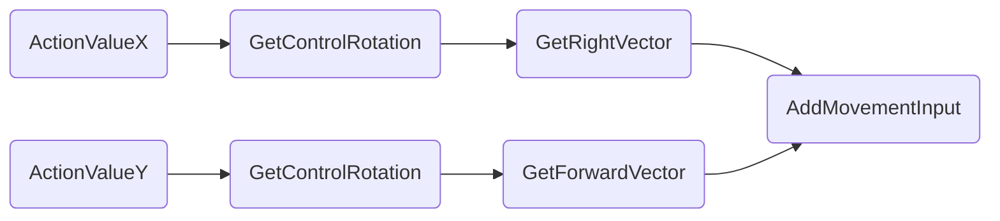

# Unreal5功能整理

## 1.场景

### 1.1 天空

#### 1.1.1 无太阳(Sun Brightness)

> 解释:关闭太阳贴图
>
> 组件:BP_Sky_Sphere -> Sun Brightness

#### 1.1.2 多云(Cloud Opacity)

> 解释:控制云朵数量
>
> 组件:BP_Sky_Sphere -> Cloud Opacity

#### 1.1.3 星星(Stars Brightness)

> 解释:控制星星数量
>
> 组件:BP_Sky_Sphere -> Stars Brightness

### 1.2 环境

##### 1.2.1 镜头光晕(Lens Flares)

> 解释:光打进镜头里产生的炫光
>
> 组件:GlobalPostProcessVolume -> Lens Flares

## 2.角色

## 3.游戏性

### 3.1 全局

#### 3.1.1 重开关卡Open Level

> 解释:重开关卡，通过名字/引用
>
> 组件:蓝图->OpenLevel(by Name/by Object Reference)

#### 3.1.2 暂停游戏Pause Game

> 解释:暂停游戏
>
> 组件:蓝图->Set Game Pasued 

备注:暂停游戏情况下没法检测输入，需要在IA_Pause中打开暂停触发`Trigger when Paused`

#### 3.1.3 退出游戏Quit Game

> 解释:退出游戏
>
> 组件:蓝图->Quit Game

#### 3.1.4 返回出生地Reborn

> 解释:返回出生地
>
> 组件:蓝图->Set Actor Location给PlayerStart即可

#### 3.1.5 时间速率Slow Motion

> 解释:调整的是全局的时间膨胀系数，物理模拟加快，动画播放加快，DeltaTime变大
>
> 组件:在UE5的cmd窗口中输入slomo 5 (其中5倍表示倍率)

#### 

### 3.2 碰撞体

#### 3.2.1 碰撞体可见性(Rendering Hidden in Game)

> 解释:碰撞体范围是否在场景中可见
>
> 组件:Rendering -> Hidden in Game

### 3.3 敌人

#### 3.3.1 敌人朝向(LookAtRotation)

> 解释:当拥有两个点的时候计算二者朝向
>
> 组件:LookAtRotation

配合函数:SetActorRotation，RlnterpTo

#### 3.3.2 材质颜色变化(Set Vector Parameter Value)

> 解释:修改敌人攻击时的颜色
>
> 组件:StaticMesh下创建DyanmicMT然后使用Set Vector Parameter Value函数实现

推荐放在BeginPlay然后才是ConstructFunc

#### 3.3.3 AI移动(AIMoveTo)

> 解释:移动AI到区域
>
> 组件:AIMoveTo

备注:需要配合Navmesh才能使用，Destination和TargetActor填一个就行，建议Acceptance填个100cm左右

在项目设置中可以设置NavMesh的单元格大小，高度等具体细节。

#### 3.3.4 棋子感知(PawnSensing)

> 解释:实现AI 基础感知能力的组件,赋予了AI眼睛和耳朵发现玩家或其他物体
>
> 组件:StaticMesh下创建DyanmicMT然后使用Set Vector Parameter Value函数实现

#### 3.3.5 旋转优化(Orient Rotation to Movement)

> 解释:使用内置功能使朝向与移动方向对齐，即优化瞬间旋转变为缓慢旋转为目标方向
>
> 组件:关闭Pawn的ControlRotationYaw，然后打开CharacterMoveComp的Orient RotationToMovement的开关

### 3.4 建模

#### 3.4.1 编辑轴心(Edit Pivot)

> 解释:导入的模型需要对轴心进行永久调整，临时修改可以参考Alt+鼠标中键
>
> 组件:建模模式->XForm->EditPivot

### 3.5 人物

#### 3.5.1 人物输入(Input)

> 一句：虚幻通过在输入层将 $W/S$ 拌合至 $Y$ 轴，牺牲了局部直觉，换取了全局（手柄/键盘/UI）在横纵语义上的统一。
>
> 解释:首先虚幻是左右系，所以X是世界坐标的前方。但是为了统一2/3D游戏X是左右，Y是上下的行业统一坐标系和Z为上的直觉，所以在输入层面会有一点反直觉，WS是Y,AD是X。然后用Y去连接控制器的前向，用X去连接控制器的左右。最后能够统一到世界坐标中，所以这种反常仅存在输入映射这一环中。

#### 3.5.2 吸附地面

> 一句：帮助PlayerStart或者胶囊体吸附在地面上
>
> 快捷键：fn + end

## 4.引擎

### 4.1 通用

#### 4.1.1 重定向器Redirectors

> 解释:当你移动或者重命名资源时UE不会直接断开旧引用，而是在原位置生成一个 Redirector，把旧路径指向新路径。
>
> 组件:右键文件夹

修复方案：复制完成后，右键文件夹点击Fix Up Redirectors in Folder后仍需要手动删除

#### 4.1.2 反射捕获重构Reflection Captures Rebuilt

> 解释:启动SwarmAgent执行场景中光线追踪计算，计算阴影半影还有烘焙光照贴图。
>
> 组件:构建选项卡 -> 仅构建光照

## 99.疑问整理

1.为什么直射光需要勾选大气光才能正常看见天空颜色?

2.BP_Sky_Sphere为什么要挂载直射光才能产生对应的颜色变化

3.为什么skylight天空光对地面反光的影响这么大？

4.很多素材为什么是单面的，单面的最合理的处理办法是啥？

> 答:游戏引擎默认启用背面剔除Backface Culling,材质开启 Two Sided

5.Map自带的BuildData是个什么数据?（FP1.7）

> 答:关卡烘焙计算后的缓存数据。静态光照（Lightmass 烘焙结果）,光照贴图（Lightmaps）,阴影贴图,反射捕捉数据（Reflection Capture）,预计算可见性（Precomputed Visibility）,预计算体积光照（Volumetric Lightmap）

6.为什么Paragon文件的材质上来是灰的，需要手动修改为XXX_1才能显示颜色,为什么要这么设计?（FP1.7）

> 答:灰色是因为它默认使用的是基础材质实例，真正的颜色信息在对应的 XXX_1材质实例里。Paragon 采用工业级“主材质 + 多实例”架构，默认实例没填贴图，所以显示灰色，必须换成带贴图参数的实例才有颜色。

7.Material中多材料的情况是什么，模型是怎么区分多材质的？

8.组合物体移动的时候没法显示坐标，好蠢啊？

9.构造函数只要修改了蓝图都会重新计算一遍吗，会不会很吃性能，和放在start有什么区别？

> 答:是的，只要你在编辑器中修改了蓝图的属性或移动了它的位置，构造脚本就会重新运行。构造脚本是用来做静态配置的可视化”，而 BeginPlay是用来做动态运行的初始化。

10.骨骼网格体和静态网格体的区别？非人形敌人一般用什么比较好？（FP4.2）

11.函数与宏的区别，可以从代码角度分析？

12.构建光照数据背后在干什么，为什么要花这么长时间?

> 答:引擎会启动SwarmAgent主要负责以下三件事，光线追踪计算，计算阴影半影还有烘焙光照贴图。

13.为啥改变材质需要设置动态材质，不能使用静态材质替换吗？

> 答:直接换一个静态材质引擎会增加很大的开销，渲染线程必须停止当前物体的绘制，解除旧材质绑定，并绑定新材质，增加CPU的Draw Call开销。静态替换需要提前准备所有的材质球，占用大量的磁盘和内存空间。什么时候该用“静态替换”？比如一个角色从“正常状态”变成了“石化状态”，两者的 Shader 算法、贴图通道完全不同。
>

14.将旋转朝向运动和使用控制器期望旋转的区别？

> 答:Orient Rotation to Movement是第三人称动作游戏，开启后，角色永远“面朝前方跑”。如果你往后拉摇杆，角色会转身面对屏幕跑过来，而不是倒着走。Use Controller Desired Rotation是带有指向性（比如射击游戏或锁定视角）常用的设置，你的镜头（控制器）往哪看，角色的身体就立刻转到哪。它和第一人称射击（FPS）的逻辑很像，只是你在第三人称也能看到身体。

15.Nanite是个什么系统，干什么的，为什么材质需要手动打开，不是跟项目的？

> 答:Nanite是UE5的虚拟化几何体系统，在 Nanite 出现之前，美术资产必须严格控制面数避免卡死。而Nanite可以直接导入无限细节模型不用手动做LOD，只渲染你屏幕像素级别能看到的细节。Nanite主要针对Mesh。 但在材质编辑器里，如果有特殊的位移效果(在 UE 5.3+ 版本中，Nanite 引入了可编程光栅化。如果你想让材质通过一张贴图直接在模型上生成真实的凹凸几何细节（不再是法线贴图那种视觉欺骗），你必须在材质设置里开启 Nanite 选项)。
>

