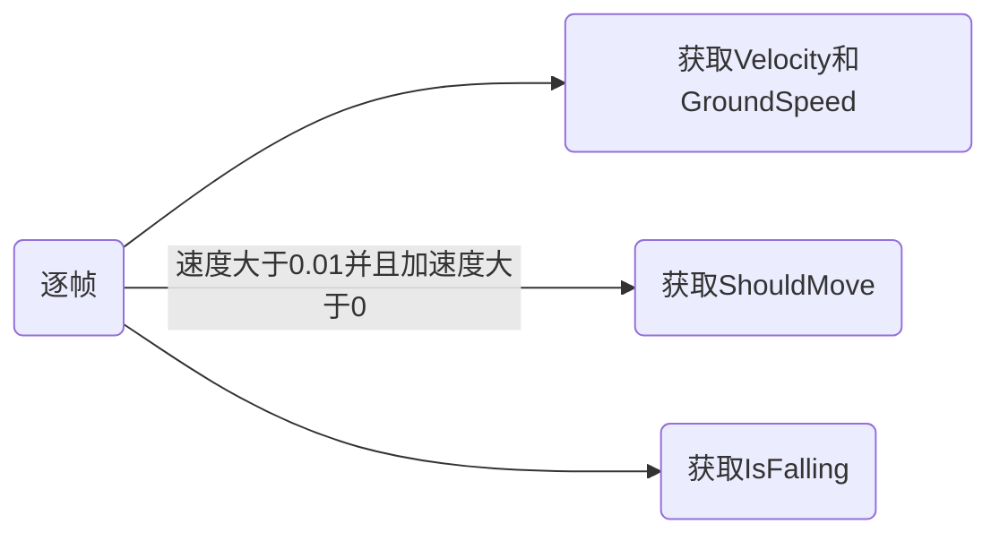

# UE5动画

> | 序号 | 课程                                         | 作者     | 链接                                                         | 备注                                                         |
> | ---- | -------------------------------------------- | -------- | ------------------------------------------------------------ | ------------------------------------------------------------ |
> | 1    | Introduction to Materials in Unreal Engine 5 | Mao Mao  | [Udemy](https://www.udemy.com/course/introduction-to-materials-in-unreal-engine-5/) | [b站](https://www.bilibili.com/video/BV1kvDsBAEGz?spm_id_from=333.788.videopod.episodes&vd_source=9a146b8fa39d5ea05ce3a524dcff45d4) |
> | 2    | 虚幻（UE5）角色动画基础                      | 亿峥游戏 | [b站](https://www.bilibili.com/video/BV1ow411U7Eh)           |                                                              |

#### 0.待分类

##### 1.骨骼

##### 2.骨骼网格体

##### 3.Mannequin_LODSettings

#### 1.混合空间

Snap to Grid 对齐到网格

动画混合

#### 2.八叉树

#### 3.正向移动

#### 4.根骨骼运动RootMotion

移动与动画系统相结合，表示角色的整体运动(包括物理)是由动画来驱动的。

配置根骨骼:Rootmotion动画需要模型的根骨骼不能运动，如果模型的根骨骼参与了运动就需要在建模
软件中重新配置:
在播放Rootmotion时，需要启用根骨骼

#### 5.插槽

#### 6.动画蒙太奇

蒙太奇我扫描要插槽才能动？

- 将多个不同动画序列组合成一个资源
- 将一个动画资源分成若干段，可以选择播放其中的个别片段
- 添加事件来执行本地的其他任务

注：要播放动画蒙太奇，需要在AnimGraph中添加插槽

蒙太奇动画通知

蓝图中OnNotifyBegin获取

#### 7.状态机

#### 8.Motion Warping

在播放动画的同时，动态地拉伸或旋转角色的位姿，确保动作能精准地对齐目标点。

Motion Warping 通常是配合Root Motion（根运动）使用的：

1. 动画本身自带位移（Root Motion）。
2. Motion Warping 在蓝条区间内，对这个 Root Motion 进行微小的加权偏移（Offset）。

#### 9.动画通知

#### 10.骨骼重定向

#### 11.骨骼网格体

#### 12.蒙皮

#### 13.TPose

#### 14.InPlace

#### 15.骨骼名称

| 序号 |   Bone Name   |  中文名称  | 别称 | Manny | 作用说明               |
| :--: | :-----------: | :--------: | :--: | :---: | ---------------------- |
|  1   |     root      |   根骨骼   |      |   √   | 整个角色的世界根节点   |
|  2   |    pelvis     |    骨盆    | hips |       | 身体中心，用于整体运动 |
|  3   |   spine_01    |   脊柱1    |      |       | 下背部                 |
|  4   |   spine_02    |   脊柱2    |      |       | 中背部                 |
|      |   spine_03    |   脊柱3    |      |       | 上背部                 |
|      |   spine_04    |   脊柱4    |      |       | 胸腔                   |
|      |   spine_05    |   脊柱5    |      |       | 上胸/连接锁骨          |
|      |  clavicle_l   |   左锁骨   |      |       | 连接躯干与手臂         |
|      |  upperarm_l   |   左上臂   |      |       | 肩到肘                 |
|      |  lowerarm_l   |   左前臂   |      |       | 肘到手腕               |
|      |    hand_l     |    左手    |      |       | 手掌控制               |
|      |  thumb_01_l   |  左拇指1   |      |       | 拇指根部               |
|      |  thumb_02_l   |  左拇指2   |      |       | 拇指中段               |
|      |  thumb_03_l   |  左拇指3   |      |       | 拇指末端               |
|      |  index_01_l   |  左食指1   |      |       | 食指根部               |
|      |  index_02_l   |  左食指2   |      |       | 食指中段               |
|      |  index_03_l   |  左食指3   |      |       | 食指末端               |
|      |  middle_01_l  |  左中指1   |      |       | 中指根部               |
|      |  middle_02_l  |  左中指2   |      |       | 中指中段               |
|      |  middle_03_l  |  左中指3   |      |       | 中指末端               |
|      |   ring_01_l   | 左无名指1  |      |       | 无名指根部             |
|      |   ring_02_l   | 左无名指2  |      |       | 无名指中段             |
|      |   ring_03_l   | 左无名指3  |      |       | 无名指末端             |
|      |  pinky_01_l   |  左小指1   |      |       | 小指根部               |
|      |  pinky_02_l   |  左小指2   |      |       | 小指中段               |
|      |  pinky_03_l   |  左小指3   |      |       | 小指末端               |
|      |  clavicle_r   |   右锁骨   |      |       | 连接躯干与手臂         |
|      |  upperarm_r   |   右上臂   |      |       | 肩到肘                 |
|      |  lowerarm_r   |   右前臂   |      |       | 肘到手腕               |
|      |    hand_r     |    右手    |      |       | 手掌控制               |
|      |    thigh_l    |   左大腿   |      |       | 髋到膝                 |
|      |    calf_l     |   左小腿   |      |       | 膝到脚踝               |
|      |    foot_l     |    左脚    |      |       | 脚掌                   |
|      |    ball_l     | 左脚掌前端 |      |       | 控制脚尖               |
|      |    thigh_r    |   右大腿   |      |       | 髋到膝                 |
|      |    calf_r     |   右小腿   |      |       | 膝到脚踝               |
|      |    foot_r     |    右脚    |      |       | 脚掌                   |
|      |    ball_r     | 右脚掌前端 |      |       | 控制脚尖               |
|      |    neck_01    |    颈部    |      |       | 连接头部               |
|      |     head      |    头部    |      |       | 控制头                 |
|      | ik_foot_root  |   IK脚根   |      |       | IK系统用               |
|      |   ik_foot_l   |   左脚IK   |      |       | 脚部IK定位             |
|      |   ik_foot_r   |   右脚IK   |      |       | 脚部IK定位             |
|      | ik_hand_root  |   IK手根   |      |       | IK系统用               |
|      |   ik_hand_l   |   左手IK   |      |       | 手部IK定位             |
|      |   ik_hand_r   |   右手IK   |      |       | 手部IK定位             |
|      |  ik_hand_gun  |   武器IK   |      |       | 控制双手持枪           |
|      | ik_hand_r_gun | 右手武器IK |      |       | 精细武器对齐           |

| 序号 |   Bone Name    |  中文名称  | 别称 | Manny | 作用说明              |
| :--: | :------------: | :--------: | :--: | :---: | --------------------- |
|  1   |      root      |   根骨骼   |      |   √   | 整个角色的世界根节点  |
|  2   | center_of_mass |    重心    |      |   √   | 开启物理时告诉重心    |
|  3   |  ik_foot_root  | IK脚根骨骼 |      |   √   | 用于处理脚部贴地      |
|  4   |   ik_foot_l    |   IK左脚   |      |   √   |                       |
|  5   |   ik_foot_r    |   IK右脚   |      |   √   |                       |
|  6   |  ik_hand_root  | IK手根骨骼 |      |   √   | 处理手部动作,对齐手掌 |
|  7   |  ik_hand_gun   |  IK手武器  |      |   √   | 适配不同长短的武器    |
|  8   |   ik_hand_l    |   IK手左   |      |   √   |                       |
|  9   |   ik_hand_r    |   IK手右   |      |   √   |                       |
|  10  |  interaction   |  交互锚点  |      |   √   | 角色与外部世界对齐    |

核心用途：IK 系统

- 地面贴合（Foot Placement）：即使你的动画本身是平地走路，开启 IK 后，系统会根据 `ik_foot_l/r` 的位置去检测地面高度，修正骨骼，防止脚陷入地板或悬空。
- 手部对齐:比如 ik_hand_gun，在做开火或换弹动画时，它能保证左手始终紧贴在枪的前握把上，而不会因为角色呼吸晃动导致手和枪分离。

附件绑定与对齐

动画重定向

运动学数据采集

#### 16.IK

#### 17.默认动画状态

#### 18.分层骨骼混合

BlendBones

节点Layered blend per bone