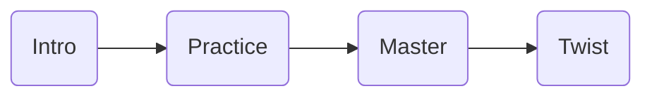

# GDC—优秀关卡设计的10个原则

> 标题：Ten Principles for Good Level Design
>
> 作者：Dan Taylor
>
> 工作室：史克威尔艾尼克斯工作室
>
> 
>
> 链接：https://www.youtube.com/watch?v=iNEe3KhMvXM
>
> b站：https://www.bilibili.com/video/BV1Mv4y1m713/

#### 1.(好的关卡设计需要)有趣的引导

> Good Level Design is Fun To Navigate

要让玩家有良好的体验，就必须让玩家知道自己该往哪里走。

游戏需要有统一的视觉语言来引导玩家走上正确的路线。

- 视觉引导
    - 光线
    - 图形
    - 颜色
    - 动画

比如在游戏《镜之边缘》中，可行走的路线是红色的，不可行走的路线是白色的。

  
      
    

需要注意的一点是，有趣的引导并不一定是明确的引导，混乱的引导也有可能是有趣的引导。

- 隐藏路径
- 捷径

也会让玩家感受到成就感，给关卡添加了深度和重玩性。

比如：《使命召唤6：现代战争2》中的贫民窟关卡，就是个混乱引导的例子。整个关卡拥挤且扭曲，没有明确的路径指引。在这个关卡中玩家很难找到通路，但这个关卡确实是有趣的。

#### 2.(好的关卡设计)不依赖文字

> Good Level Design does not Rely On Words

在游戏关卡中有3种叙事手段

- 明示型叙事：通过过场动画，台词对话，文本资料等方式直接把故事告诉玩家

- 暗示型叙事：不告诉玩家故事是什么，让玩家通过自己的观察来发现故事

    - 环境叙事/场面调度(Mise-en-scene)：传统舞台剧和戏剧的常用手段
    - 举例：《生化奇兵1》通过杂乱的场景，构造了一种很诡异的氛围，让玩家觉得不舒服来彰显环境叙事。

    

- 涌现型叙事：让玩家来讲自己故事，玩家的游戏行为来构造属于玩家自己的故事

    - 举例：《杀手》玩家可以用各种各样的方式来杀掉目标，你自己的选择就形成了只属于你自己的杀手的故事。

        

#### 3.好的关卡设计告诉玩家做什么但不要告诉怎么做

> Good Level Design Tells What ... But Not How

当玩家进入关卡时，你需要提供给玩家

- 明确的关卡目标
- 达成目标的多种途径和方式，以满足玩家的多种游玩风格。

总之，就是鼓励玩家尝试不同的方式去达成目标，鼓励玩家的即兴创作。

举例：《上古卷轴5》

##### 3.1 并行式任务

​	提供给玩家一系列的任务，玩家可以按任何顺序自由地去完成这些任务。当玩家完成其中一个任务后，会让其他任务更加简单，或者是会让其他任务产生一些改变。

#### 4.(好的关卡设计)会不断地教给玩家新东西

> Good Level Design Constantly Teaches

参考书籍：Raph Koster的《A Theory of Fun For Game Desgin/游戏设计快乐之道》

- 套路分析/PATTERN ANALYSIS：这本书认为人类喜欢套路分析，喜欢把套路存储于大脑并在稍后拿出来用，这会让他们感受到快乐。很多游戏的乐趣就是从这种套路分析中产生的。如果套路分析过早结束，游戏的乐趣也会消失。所以我们需要通过关卡设计来延长这种乐趣，就需要不停地教给玩家新的套路。

举例：《塞尔达传说：旷野之息》中每当你进入一个新的地牢时，你会获得一个新装备，而关卡里的每个房间都会教给你这个新装备的不同的用法。当你到达外部的大世界时，你也需要不停使用这个装备，用全新的方式来解锁各个区域。甚至于在打最终BOSS的时候，都会再教给你这个装备还有全新的用法。

  
      
      
      

##### 4.1 LPCS游戏节奏理论

Bethesda的LPCS游戏节奏的理论:Learn→Play→Challenge→Surprise

​	关卡设计师会先教给玩家一个新机制，然后在一个安全的区域内，让玩家练习这个新机制。然后提供一个有挑战性的关卡来测试玩家的掌握程度。就在玩家感觉自我良好时，再用一些疯狂的东西来给玩家惊喜。

##### 4.2 IPMT关卡设计理论

Intro→Practice→Master→Twist

​	关卡设计师需要

- Intro：在玩家没有任何生命威胁的情况下，展示单一的新机制。
- Practice：在稍微复杂一点的环境中重复该机制，建立信心。
- Master：将新机制与旧机制结合，并在有压力（战斗/时间/资源）的情况下测试。
- Twist：改变机制的固有逻辑，或者将其推向某种“疯狂”的极致。

#### 5.(好的关卡设计)要给玩家惊喜

> Good Level Design Is Surprising

惊喜不是惊吓，是要让关卡设计给玩家带来新鲜感，不要墨守成规。

过山车式的节奏控制：游戏关卡的节奏会先越来越强，会给玩家带来情感上的上升。在激烈的高潮之后，进入一个低谷来让玩家缓缓，平复心情。接着再进入一个更大的高潮，整体节奏就呈现一个过山车式的感觉。

但是这种节奏设计玩家见得多了，就没有办法带来惊喜，所以我们需要颠覆传统的设计。

举例：《死亡空间2》有一个关卡是和一代一样的场景，在一代里这个场景里有很多怪物，但是在二代里却空无一人。玩家在进入关卡5分钟后，会开始跃跃欲试。但是什么都没有，玩家在进入关卡10分钟后，就会开始疑惑。直到玩家进入关卡的第15分钟，玩家到达了飞船的中心通道，一个巨大的怪物从天而降。

#### 6.(好的关卡设计)让玩家强大

> Good Level Design Empowers The Player

​	游戏设计师需要让玩家伟大，游戏本质上是逃避现实，所以不能在任务里给玩家一个购物清单。为什么人们想要逃避现实？因为现实生活太烂了。在现实生活中每天都要经历的槽糕体验，所以就不要在游戏让玩家继续经历了。在大部分游戏里，玩家都喜欢扮演混蛋，因为这样能让他们把现实中的不满发泄出来。

举例：《红色派系:游击战》游戏没有让你开车经过收费桥，而是让玩家拿着能蒸发金属的狙击枪去摧毁收费桥。要让玩家感受到自己能改变世界，并且改变后的世界要给玩家反馈。

#### 7.(好的关卡设计)应该是简单，中等，困难

> Good Level Design Is Easy, Medium And Hard

​	怎么让关卡变得又简单又困难呢?

- 把基础的路线设置成简单的或者中等难度的，然后再另外加一条高难度路线，在这条高风险路线上设置更加丰厚的奖励。
- 如果主线关卡难度高了，游戏设计师可以给玩家再额外加一条简单的支路。

​	核心思想就是动态难度，即给玩家提供多种不同难度的游玩路径，让玩家自己去选择怎么去完成任务。越困难的游玩方式，奖励就越高。

|    作者    | 观点                                                     |
| :--------: | -------------------------------------------------------- |
| Dan Taylor | 讨厌传统游戏那种，玩家一开始就选择简单还是困难模式的设计 |
|    Up主    | 认为不从一开始就进行区分可能会导致强者恒强的恶性循环     |

#### 8.(好的关卡设计)是高效的

> Good Level Design Is Efficient

​	游戏制作的资源是很有限的，很大程度上会限制游戏开发。

- 在技术层面，可能游戏开发平台的机能有限，内存不足

- 在现实层面，游戏的制作周期，团队规模，预算

    所以游戏设计师需要做到最大限度的利用可用资源，关卡设计就需要去重复利用。

​	常见的做法是模块化设计。一个好的关卡设计师，不会去设计一个单一的关卡，而是设计一系列根据玩家行为做出反应的模块。这些模块拼成第一个关，也可以拼成第二个关。通过简单地对模块进行一些修改，就可以创造出阶梯式的挑战和丰富的新鲜感。

举例：《死亡细胞》就是经典的模块化设计。他们设计了上干个游戏房间的模块，然后用一定的算法进行随机组合。既确保了单个房间的游玩体验，又产生了足够的随机性和重玩性。[死亡细胞团队分享Dead Cells 的随机地图生成](https://indienova.com/indie-game-development/the-procedurally-generated-map-of-dead-cells/)。

#### 9.(好的关卡设计)创造情感(Creates Emotion)

> Good Level Design Creates Emotion

​	大家都说游戏是第九艺术，在艺术领域，有一种和关卡设计非常相似的艺术形式就是建筑艺术。所以关卡设计师可以从建筑学理论中偷学很多技巧。

举例真实世界的窗户相较于膝盖高低的不同如何影响玩家情感

- 窗户高度低于膝盖，那会给人一种力量感和偷窥感。
- 窗户高度高于肩膀，那会给人一种压迫感和囚禁感。

类比到游戏中

- 紧张感：用狭窄的角落来限制玩家的视野，来让玩家产生多疑和紧张的情感
- 恐惧/困惑感：让关卡像迷宫一样扭曲，来让玩家产生困惑和恐慌的情感
- 孤独/史实感：用开阔的场景来创造孤独和史诗的情感

从情感出发，你想要给玩家什么样的情感，然后再去思考空间、故事、游戏机制等等，来触发情感。

举例：《英雄连》的卡灵顿任务，你需要坚守一个城镇直到援军到来。玩家一开始可能会觉得我只是防守一个区域，也不是很困难。但游戏实际上做了很特殊的设计，只有当你战斗到只剩一兵一卒的时候，援军才会出现。这就会让整个体验非常刺激，让玩家体会到那种绝处逢生的感觉。

#### 10.(好的关卡设计)是由游戏机制驱动

> Good Level Design Is Driven By Mechanics

游戏机制是整个游戏的核心，关卡设计必须去展现游戏机制，去展现游戏玩法。而且，不能仅仅停留在展现出来玩法机制，还要更进一步地，始终让玩法机制保持新鲜感，不断以一种很新的形式去展现玩法机制。比如游戏的某些玩法机制不仅可以用于战斗，还可以用于剧情解谜。这就是很好的关卡和机制结合的例子。

