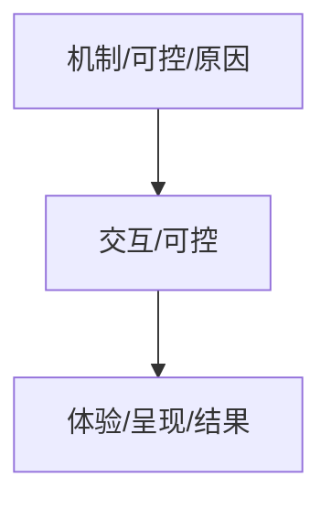

# 游戏拆解

> | 序号 | 课程                                             | 作者   | 链接                                               | 备注 |
> | ---- | ------------------------------------------------ | ------ | -------------------------------------------------- | ---- |
> | 1    | 闲聊：游戏的【叙事文本】怎么做？（现实世界观篇） | 老闲愚 | [b站](https://www.bilibili.com/video/BV1f8dMBFEy2) |      |
> |      |                                                  |        |                                                    |      |
> |      |                                                  |        |                                                    |      |

### 0.待分类

#### 1.目的

分析游戏为什么好玩，而不是把所有系统列出来

第一步:

这个游戏带给了你什么样的感觉?不同类型的游戏想要给人带来的体验不同尝试用更加准确的词语来概括出这些游戏带给你的体验吧

- 动作游戏的核心体验高速战斗的流畅爽快感钻研连招打出高评价的成就感
- 策略游对的核心体验选择的决策感一综合形势估选择正确的成就感
- 其他类型游戏的核心体验探索未知时的好奇心获得新知时的满足感

顺序

- 这个游戏带给了你什么样的感觉?
- 玩游戏时你具体在做什么?
- 游戏机制是什么

#### 2.斯金纳箱

#### 3.引力锚点

引力锚点的目标设计为玩家在探索过程中提供驱动力十足的目标

三角形场景对引力锚进行阻挡同时控制引力锚释放给玩家的节奏玩家移动中引力锚逐渐浮现，给玩家自行发现的感觉

#### 4.核心体验

《深海迷航》就是基于未知的恐惧

《生化危机:村庄》的核心体验是挣扎求生

### 1.游戏拆解思路

#### 1.MDA框架：机制、行为、体验

- Mechanic 机制
- Dynamic 交互
- Aesthetics 体验

##### 4.1 Mechanic 机制

> 目的：游戏是如何运作的
>
> 发生：Code代码

##### 4.2 Dynamic 交互

> 目的：玩家是如何反应的
>
> 发生：Actions行为

##### 4.3 Aesthetics 体验

> 目的：玩家是如何感受的
>
> 发生：Feelings感受

### 9.参考

#### 1.网站

明日方舟肉鸽设计底层逻辑拆解：https://zhuanlan.zhihu.com/p/15884148041

如何设计让玩家感到自我提升的boss战（一）：https://zhuanlan.zhihu.com/p/708806893

How To Think Like A Game Designer:https://www.youtube.com/watch?v=iIOIT3dCy5w

#### 2.论文

1.《MDA: A Formal Approach to Game Design and Game Research》Robin Hunicke, Marc LeBlanc, Robert Zubek 2004
