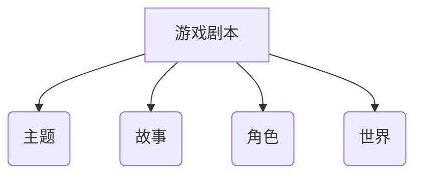
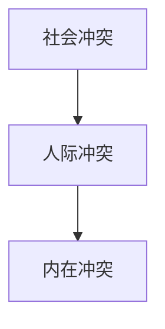

# 游戏文案

> | 序号 | 课程                                                         | 作者           | 链接                                               | 备注 |
> | ---- | ------------------------------------------------------------ | -------------- | -------------------------------------------------- | ---- |
> | 1    | 闲聊：游戏的【叙事文本】怎么做？（现实世界观篇）             | 老闲愚         | [b站](https://www.bilibili.com/video/BV1f8dMBFEy2) |      |
> | 2    | 【游戏开发指南】编剧入门·故事是生活的比喻                    | 心平气和考拉兄 | [b站](https://www.bilibili.com/video/BV1hK411u7Mr) |      |
> | 3    | JRPG/Galgame的剧本原来是这么写出来的？一起来读《游戏剧本怎么写》 | LunaticMosfet  | [b站](https://www.bilibili.com/video/BV13u4y1L79a) |      |
> | 4    |                                                              |                |                                                    |      |
> | 5    | 四种常见的故事结构，适用大部分故事的框架，起承转合           | 火星生存长老   | [b站](https://www.bilibili.com/video/BV1xe411e7GX) |      |
> | 6    | 我太想吐槽二游文案了                                         | 差评游戏部     | [b站](https://www.bilibili.com/video/BV1Qi5QzSEvH) |      |
> |      |                                                              |                |                                                    |      |

### 0.实现流程

#### 1.洗稿

#### 2.信息密度

#### 3.文字辞藻

### 1.游戏剧本

> 别称：游戏剧情，叙事文本，故事创作，游戏台词

故事是个想法，白话文不是脚本，台词是找寻角色内心的表达。

不像小说，要补齐环境描述 √

不像电影，可以通过镜头语言 ×

#### 1.1 剧本大纲

大纲顺序

- 确立主题
- 确定核心气质
- 设定世界核心规则
- 设计主角：愿望和信念，而不是贴标签
  - 愿望无法轻易达成
  - 自觉愿望和不自觉愿望/产生冲突
- 设定前史
- 写正文梗概

### 2.主题

> 表达：能使游戏给人一定的印象，并赋予游戏一定的方向性。

一句话确定主题，极其凝练，决定故事的层次高低。

举例主题

- 最强
- 男女之间的友情
- 超时空的复仇能否实现
- 菜鸟辩护律师上法庭会发生什么

常用对立主题

| 对立主题 | A          | B          | 注释                         |
| -------- | ---------- | ---------- | ---------------------------- |
| 1        | 过程       | 结果       | 对过程和结果的谈论           |
| 2        | 个人的奋斗 | 历史的进程 | 虚无主义与命运的斗争，继承者 |
| 3        | 程序正义   | 世俗公平   |                              |
| 4        | 生态和谐   | 大力发展   | 发展的目的，生态的意义       |
|          |            |            |                              |

| 主题 | 过程                 | 结果                           |
| ---- | -------------------- | ------------------------------ |
| 描述 | 追求过程正确 A       | 追求结果正确 B                 |
| 难点 | 如何证明过程正确     | 如何解释错误的手段             |
| 翻转 | 逐渐发现过程是错误的 | 用另一种正确的方式也能获得结果 |
| 丰富 | 选择看似过程的结果 C | 选择看似结果的过程 D           |
| 案例 | 朱雀/Saber           | 鲁路修/卫宫切嗣                |

A - 坚定相信过程  B -坚定相信结果

C - 逐渐发现错误（多主角表无奈） D - 逐渐发现错误（多强变化）

### 3.世界观

现实世界观|架空世界观

流行风格：黑深残

为玩法添加世界变量（设定），单一变量就行，崩坏能等，为后续变化的细节服务

### 4. 故事

> 表达：用来向玩家表达主题的内容

- 承载游戏主题
- 连接游戏目的/玩法

罗伯特麦基：故事是生活的比喻（它必须源于生活且高于生活）

- 新鲜的见识
- 真挚的情感
- 富有哲理的思想
- 发人深省的真相

好故事的特征：

- 有趣、真实、紧凑
- 回味悠长的主题
- 规避陈词滥调

何为有趣？见识（独特性，类似教父的黑帮生活）、情感

冲突是故事必备的，主题是可选项但是可以升华故事

#### 4.1 故事主题

主题 = 故事核心思想

一个没有思想的故事注定是平庸的

主题最常见的形式A>B

AB指代2种对立价值例

如:过程与结果

A>B的两种表现形式:

1、主角在AB中做选择

2、两个主角分别代表AB并在决斗中分出胜负

如何设置A和B?
A正义    B?  ：必须是两恶取其轻，两善择其一

#### 4.2 故事的创作方法

- 从主题出发，发挥想象
  - 例:主题是“如何逃出丧尸横行的洋馆”
- 锻炼编故事的能力/寻找灵感
  - 点子库/创意库
  - 书、电影、历史中寻找原型

游戏剧本类似于经典的三幕式剧本，但又有属于自己的特点。

- 开端:通过一个恰当的切入点向玩家介绍游戏的目标、玩法和内容前瞻。
- 发展:游戏的主要流程，主线剧情可以分为达成游戏目的章节(设置阻碍/提供帮助)、推进剧本章节(转折)以及加深主题(刻画)章节
- 结尾:包含游戏的高潮与结局。高潮需要长度适中且能调动玩家的情绪，结局需要与玩家在高潮或发展中做出的选择相呼应(线性可不考虑)。

 

冲突的三个层次，社会冲突包裹人际冲突，人际冲突包裹内在冲突

|       | 自觉愿望 | 不自觉愿望 | 信念 |
| ----- | -------- | ---------- | ---- |
| 角色1 |          |            |      |
| 角色2 |          |            |      |
| 角色3 |          |            |      |

#### 4.3 故事设定

好的故事设定：

- 新颖
- 经得起推敲：钢之炼精术师等价交换
- 契合主题
- 拓展性强：型月世界
- 无冗余设定
- 契合玩法

故事的可信度

常规≠陈词滥调

创新的本质是重组

#### 4.4 故事情感

人们在看故事的时候会本能地考察这个世界和人物，力求分清善于恶，以及有价值和无价值的事物，试图寻找一个叫善之中心的东西。

期望-鸿沟-选择

情感代入的前提是主角和我有相似之处。

#### 4.5 故事线

> 相关：故事结构

让故事紧凑，或者说让文本结构化，没有无意义的废话

推荐：先结构化，再去结构化

- 序·破·急：三幕剧
- 起承转合：四幕剧

时间的发展脉络，发展状况和发展方向

#### 4.6 高级故事

小说脚本化

- 使用精准的短句会让剧本可读性更好(当然CRPG另说)
- 作者需要考虑信息的传递节奏和顺序，尽可能将玩家的体验与游戏信息结合起来
- 想要吸引玩家就需要站在玩家的角度思考

分支写作

- 游戏剧本与传统剧本的最大差异便是分支情节。与小说写作的单线创作不同，游戏写作需要考虑故事中的事件是否需要添加不同的处理方法，不同方法所带来的后果，不同后果在选择前的伏笔，以及后果是否对之后的事件和最终的结局有所影响，工作量非常可观。
- 分支写作需要作者对剧本的设定和角色有充分的了解，从而能够写出符合情况的选项和选项对应的后续情节。分支情节越多，越需要对剧本的整体把控，作者必须及时结束分支或并入一个统一收束点。

### 5.角色

- 拥有个性、目的、意志、感情并依此生活、思考和行动的个体
- 角色推动故事发展能否着重表现角色的目的与意志如何表现角色向着目标奋勇前进

人物的性格行为动机

#### 5.1 角色冲突

> 别称：角色纠葛

​	纠葛是强烈体现角色意志、目的和感情的有效手段。所谓纠葛，就是人与人的对立。有些时候也用来形容在内心的几种互斥欲求之间难以抉择的心境。也就是说，纠葛有战斗、对立、竞争和冲突等外在形式，也有内心的烦恼这种内在形式。

### 6.叙事表达

> 别称：文笔

现实世界观：少即是多，省去毫无意义的文字辞藻

浮躁拒绝长文本，但是需要高信息密度

景物描写，能省则省，旁敲侧击都可以

相较于传统叙事

存在选择按键

#### 6.1 叙事结构

线性叙事:常见于电影化游戏，叙事方式和结构都趋于模仿影视剧，无分支选择
树状叙事:常见于JRPG和文字AVG游戏，在主线剧情结尾存在关键选择
网状叙事:常见于美式RPG和叙事类游戏，关键选择和剧情线较多且分散在游戏流程中

碎片化叙事:大多数游戏其实或多或少都会采用以补全故事，比如可收集的录音带，但魂系列证明其也能用于游戏的整体叙事(很谜语就是了)
多周目叙事:额外剧情只有通过多次通关才能触发，增加游戏时长的一种方法
非线性叙事:实际上也是线性叙事，将一个完整的故事拆成几部分再拼接

#### 6.2 叙事风格

​	在美式RPG游戏，尤其是较为老派的俯视角CRPG中，游戏叙事风格大多表现为文本量巨大，对话长，有对于游戏环境和角色心理的细致第三人称描写，阅读体验类似小说。

​	在JRPG中，游戏叙事一般着重于主角以及主角团角色的塑造，叙事风格以大量简短的人物对话为主，基本都是群像剧。

### 8.其他概念

#### 8.1 内部语言 internal language

> 简化：就是内心的声音

​	内部语言是心理语言学术语，指个体在思维活动中使用的非交际性语言符号系统，具有通过语词符号处理任务而不直接进行言语表达的特征。该术语由维戈茨基最先提出，认为其由外部言语压缩内化形成研究表明，许多患有严重表达性言语障碍的儿童仍能通过适当操作游戏物品、运用非语言交流方式展现内部语言功能。内部语言在功能上具有述谓性，主要与欲望、需求等表达相关，语言成分中动词和形容词占比较高;在形态上呈现凝缩性特征，表现为语法形态不完整、句法结构松散目仅含密集中心词。神经影像学表明其与左内侧额叶脑回(含布洛卡区)相关，具有行为调控和元认知功能。
​	维戈茨基提出该概念源于儿童期社交对话的内化，2011年研究发现60%人群内部语言具有社交对话特征，证实其对话属性假说。作为心理主观意向转化为外部言语的中间环节，内部语言既不同于思想也不同于外部言语，表现出独特的符号处理机制。

### 9.参考资料

#### 9.1 书籍

1. 《游戏剧本怎么写》佐佐木智广
2. 《游戏情感设计》Katherine Isbister
3. 《故事》罗伯特·麦基

