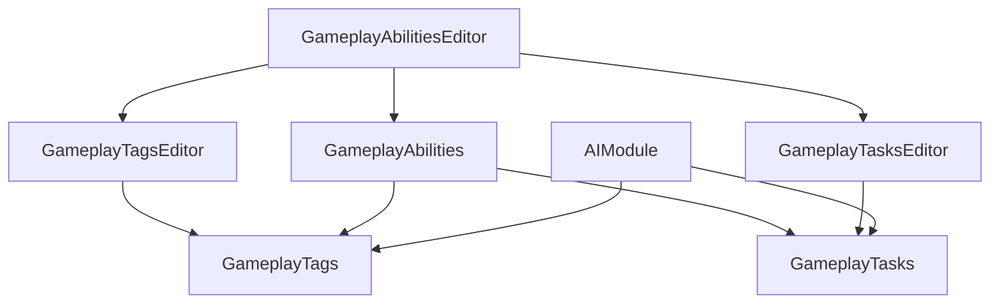

# 虚幻引擎GAS

> | 序号 | 课程                                                         | 作者         | 链接                                               | 备注 |
> | ---- | ------------------------------------------------------------ | ------------ | -------------------------------------------------- | ---- |
> | 1    | [中文直播]第31期｜GAS插件介绍（入门篇）                      | 伍德 大钊    | [b站](https://www.bilibili.com/video/BV1X5411V7jh) |      |
> | 2    | [UnrealOpenDay2020]深入GAS架构设计                           | 大钊         | [b站](https://www.bilibili.com/video/BV1zD4y1X77M) |      |
> | 3    | 给纯蓝图开发者的GAS技能系统入门【给蓝图开发者的 UE GAS教程】 | 卡露拉Carula | [b站](https://www.bilibili.com/video/BV1iF4m1N7SY) |      |
>
> 全称：Gameplay Ability System

[TOC]

#### 0.待分类

##### 1.IAbilitySystemInterface 

继承结构用来提供该物体是否存在ASC组件

##### 2.Gameplay Event 玩法事件

> 缩写：Event
>
> 类名：FGameplayEventData


- 手动触发游戏事件
- 事件靠Tag识别，可携带Payload数据
- 可触发技能
- 在另一端可等待具体Tag事件触发

WaitGameplayEvent向ASC注册回调，Send触发回调


##### 3.FGameplayAbilitySpecHandle

##### 4.FGameplayAbilityActorInfo

里面有owner和Avatar对象

##### 5.


#### 1.GAS

> 全称：Gameplay Ability System
>
> 插件：Gameplay Abilities / GameplayTagsEditor
>
> 类名：GameplayAbilities + GameplayTasks + GameplayTags

GAS是一个健壮的，高度可扩展的gameplay框架，通常用于构建RPG、MOBA等游戏的完整战斗逻辑框架。通过GAS，可以快速地制作游戏中的主动/被动技能、各种效果buff、计算属性伤害、处理玩家各种战斗状态逻辑。

GAS提供功能

- 实现了带有消耗和冷却功能的角色技能
- 处理数值属性(生命、魔法、攻击力、防御力)
- 应用状态效果(击飞、着火、眩晕)
- 应用游戏标签(GameplayTags)
- 生成特效和音效
- 完整的网络复制、预测功能


适用项目

- C++项目，开发人员有充足的C++开发经验
- 使用Dedicated Server的联机游戏
- 项目有大量且复杂的技能逻辑设计需求


历史：Epic Games从Paragon和Fortnite开始开发和使用的游戏技能框架系统

|                 优势                  |                 劣势                  |
| :-----------------------------------: | :-----------------------------------: |
|   灵活易扩展，可实现复杂的技能流程    |     大量的概念和类，学习曲线陡峭      |
|        支持联机复制和预测回滚         |         重度C++，对BP不够友好         |
|        易于团队协作和项目复用         |  需要按照框架定义一堆类才能开始启动   |
|      细粒度思考实现单个动作逻辑       |        GAS的网络服务必须配合DS        |
|           数据驱动数值配置            |   实践演化框架，可选插件，文档不足    |
|      已帮你处理繁杂流程麻烦逻辑       |    要求技术功底高，源码Debug能力强    |
| 人多-大项目-多技能-联机-技术强-重表现 | 人少-小项目-少技能-单机-技术弱-弱表现 |

什么时候用到GA

- 自带网络同步（能力不能被网络延迟限制）
- 能被其他状态打断
- 能限制释放条件
- 


不合适的情况

- 把走路写成一个GA，每帧去激活、结束这个能力，受网络延迟影响会一卡一卡的


##### 1.1 Module 模块



- GameplayTags &GameplayTasks 可被单独引用，也可以单独学习分析
- GameplayAbilities.uplugin 核心插件
- Editor模块主要是实现编辑UI


#### 2.AbilitySystem Component 能力系统组件

> 缩写：ASC
>
> 类名：UAbilitySystemComponent

Ability System Component(ASC)是整个GAS的基础组件。
ASC本质上是一个UActorComponent，用于处理整个框架下的交互逻辑，包括使用技能(GameplayAbility)、包含属性 (AttributeSet)、处理各种效果(GameplayEffect)。

所有需要应用GAS的对象(Actor)，都必须拥有GAS组件。
拥有ASC的Actor被称为ASC的OwnerActor，ASC实际作用的Actor叫做AvatarActor。
ASC可以被赋予某个角色ASC，也可以被赋予PlayerState(可以保存死亡角色的一些数据)

OwnerActor倾向拥有者，AvatarActor倾向化身。


- ASC负责管理协调其他部件:Ability、Effect、 Attribute、 Task, Event
- ASC是技能系统运行的核心
- 拥有ASC的Actor才拥有释放技能的能力
- ASC放在Pawn还是PlayerState上，这是个问题


ASC是运行的核心，很多函数其实都是通过ASC转发
技能互相作用：其实就是一个Actor上的ASC作用到另一个Actor上的ASC


#### 3.Gameplay Tag 玩法标签

> 缩写：Tag
>
> 类名：FGameplayTag

FGameplayTags是一种层级标签，如Parent.Child.GrandChild。

通过GameplayTagManager进行注册。

替代了原来的Bool，或Enum的结构，可以在玩法设计中更高效的标记对象的行为或状态。


- 层次化的字符串标签"A.B.C”
- 轻量FName，可附加到各类上做搜索条件:GameplayEffect，GameplayAbility，GameplayCue, GameplayEventData
- 整体所有Tag构成一颗Tag树


#### 4.Gameplay Ability 玩法能力

> 缩写：GA
>
> 类名：UGameplayAbility
>
> 作用：某个动作的能力

Gameplay Ability(GA)标识了游戏中一个对象(Actor)可以做的行为或技能。
能力(Ability)可以是普通攻击或者吟唱技能，可以是角色被击飞倒地，还可以是使用某种道具，交互某个物件，甚至跳跃、飞行等角色行为也可以是Ability。
Ability可以被赋予对象或从对象的ASC中移除，对象同时可以激活多个GameplayAbility。
注：基本的移动输入、UI交互行为则不能或不建议通过GA来实现，不建议重度使用。


float BaseValue:基础值，非最大值，永久值

float CurrentValue:当前值，Buff叠加后的值，临时值
可从DataTable或CurveTable里读取值AS可定义多个，多套属性集


UGameplayAbility可用CDO模板，也可生成实例保存状态
Spec是技能学习后的实例，带等级


#### 5.Gameplay Effect 玩法效果

> 缩写：GE
>
> 类名：UGameplayEffect

Gameplay Effect(GE)是Ability对自己或他人产生影响的途径。
GE通常可以被理解为我们游戏中的buf。比如增益/减益效果(修改属性)。
但是GAS中的GE也更加广义，释放技能时候的伤害结算，施加特殊效果的控制、霸体效果(修改GameplayTag)都是通过GE来实现的。
GE相当于一个可配置的数据表，不可以添加逻辑。开发者创建一个UGameplayEffect的派生蓝图，就可以根据需求制作想要的效果。


- 决定一个技能的逻辑效果
- 纯配置蓝图，不需要重载函数
- 配置:类型、修改器、周期、应用需求、溢出处理、过期处理、显示处理、Tags条件、免疫、堆叠、能力赋予
- Effect是修改Attribute的唯一通道!


UGameplayEffect只是作为一个数据模板

"Spec”才是每次Apply之后生成的”实例”


#### 6.Attribute Set

> 缩写：Attribute
>
> 类名：FGameplayAttribute

AttributeSet负责定义和持有属性，并且管理属性的变化，包括网络同步。
需要在Actor中被添加为成员变量，并注册到ASC(C++)。
一个ASc可以拥有一个或多个(不同的)AttributeSet，因此可以角色共享一个很大的Attribute Set，也可以每个角色按需添加Attribute Set。
可以在属性变化前 (PreAttributeChange)后 (PostGameplayEffectExecute)处理相关逻辑，可以通过委托的方式绑定属性变化。


#### 6.Gameplay Cue 玩法提示

> 缩写：GC
>
> 类名：UGameplayCueNotify


- 决定一个技能的”视觉效果”
- 可全局配置Tag-Handler的映射
- 可通过Effect触发，也可手动触发
- Static:一次性  Actor:持久
- 可重载:OnActive、WhileActive、Executed, Removed


#### 7.GameplayTask 玩法任务

> 缩写：Task
>
> 类名：UGameplayTask

UAbilityTask继承于UGameplayTask，并实现了一系列Task


- 执行异步任务的框架
- 可被单独使用
- 可用于异步长时动画动作的触发和等待
- 已经预实现好一系列Tasks
- 可重载:Activate、TickTask


可以单独使用


#### 8.纯蓝图GASCompanion

- 角色挂载`GSC AbilitySystem` 和` GSC AbilityInputBinding`输入绑定
- 添加能力GA


#### 9.其他

##### *.1 一个技能的自我修养

一个技能的自我修养:

- Who:谁放技能?AbilitySystemComponent
- How:技能的逻辑?GameplayAbility
- Change:技能的效果? GameplayEffect
- What:技能改变的属性?GamePlayAttribute
- If:技能涉及的条件?GameplayTag
- Visual:技能的视效?GameplayCue
- Async:技能的长时行动?GameplayTask
- Send:技能消息事件?GamePlayEvent

##### 9.2 GAS 中其他组件的C++ 依赖度

|            GAS 组件            | 必须用 C++ 吗？ |                     实际开发中的最佳实践                     |
| :----------------------------: | :-------------: | :----------------------------------------------------------: |
|          AttributeSet          |       是        |               必须在 C++ 中定义属性和同步函数                |
| Ability System Component (ASC) |     非必须      | 可以在蓝图挂载，但强烈建议在 C++ 的 Character 基类中初始化，否则会有网络异步问题 |
|     Gameplay Ability (GA)      |       否        |  绝大多数技能逻辑（播动画、放特效、判定）完全可以在蓝图里写  |
|      Gameplay Effect (GE)      |       否        |       现代 UE 版本中，GE 已经几乎完全数据化/蓝图化了。       |
|       Gameplay Cue (GC)        |       否        |       表现层（声光特效），完全可以通过蓝图或配置处理。       |

别担心，你只需要写一次 C++：

最佳工作流： 在 C++ 里写一个通用的 AttributeSet，把游戏里可能用到的基础属性（血量、蓝量、攻击力、防御力、移动速度）一股脑全定义好。 编译成功后，你就再也不用碰 C++ 了。接下来的技能逻辑、数值平衡、Buff 效果，全都在蓝图里起飞。


### 10.资料

#### 10.1 中文文档

原本文档：https://github.com/tranek/GASDocumentation

中文版文档：https://github.com/BillEliot/GASDocumentation_Chinese

官方文档：https://docs.unrealengine.com/en-US/Gameplay/GameplayAbilitySystem/index.html

入门教学：https://www.cnblogs.com/JackSamuel/p/7155500.html


#### 10.2 插件

- GASAttachEditor 实时显示属性
- GAS Companion
- Gameplay attribute blueprint
- Blueprint Attributes 纯蓝图创建

```
其他插件 类似GAS的插件
1.Able Ability System 更简单
2.Ascent Combat Framework 比GAS更大
```

