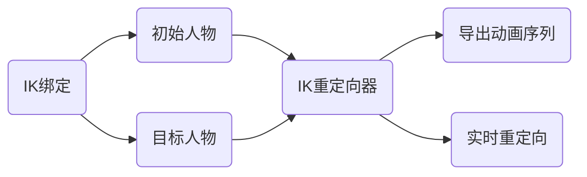
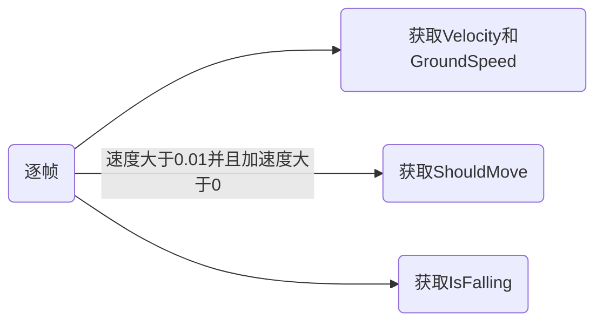
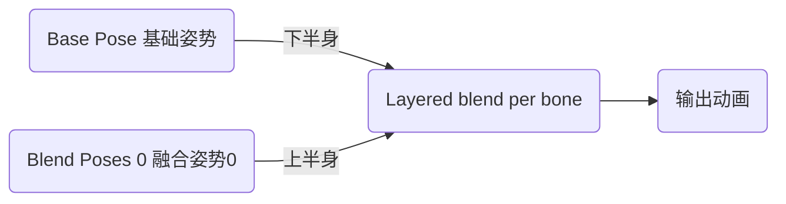

# 虚幻引擎动画

> | 序号 | 课程                                                         | 作者         | 链接                                                         | 备注                                                         |
> | ---- | ------------------------------------------------------------ | ------------ | ------------------------------------------------------------ | ------------------------------------------------------------ |
> | 1    | Introduction to Materials in Unreal Engine 5                 | Mao Mao      | [Udemy](https://www.udemy.com/course/introduction-to-materials-in-unreal-engine-5/) | [b站](https://www.bilibili.com/video/BV1kvDsBAEGz?spm_id_from=333.788.videopod.episodes&vd_source=9a146b8fa39d5ea05ce3a524dcff45d4) |
> | 2    | 虚幻（UE5）角色动画基础                                      | 亿峥游戏     | [b站](https://www.bilibili.com/video/BV1ow411U7Eh)           |                                                              |
> | 3    | UE5 Series: IK Rig Retargeting in UNREAL Engine 5.3 and 5.4  | SARKAMRI     | [Youtube](https://www.youtube.com/watch?v=f6tm7NXEs0I)       |                                                              |
> | 4    | How To Do Animation Retargeting At Runtime In Unreal Engine 5 (Tutorial) | Matt Aspland | [Youtube](https://www.youtube.com/watch?v=iv5mG_cxycs)       |                                                              |

#### 0.待分类

##### 1.骨骼

##### 2.骨骼网格体

##### 3.Mannequin_LODSettings

##### 4.Anim Warping 动画翘曲组件

#### 1.混合空间 BlendSpace

Snap to Grid 对齐到网格

动画混合

#### 2.八叉树

#### 3.瞄准偏移 AimOffset

> 简称：AO
>
> 作用：实现角色朝向跟踪/局部视线的动画混合技术
>
> 解释：一个九宫格（四宫格）提供几个特定方向的静态瞄准姿势，向上/下/左/右看，引擎会根据Pitch和Yaw进行线性插值混合。

|                           适用情况                           |             不适用情况             |
| :----------------------------------------------------------: | :--------------------------------: |
| 角色需要用上半身/头部去追踪某个方向，同时下半身还要兼顾其他运动 |       全身上下都需要完全转向       |
|              射击游戏（FPS / TPS）中的枪械瞄准               | 纯手骨的微调，推荐IK或者Cotrol Rig |
|                动作/冒险游戏中的头部注视机制                 |                                    |
| 特殊道具的手持指向 比如角色手里拿着一个手电筒、一部手机、或者一把望远镜 |                                    |
|                   载具或炮塔的驾驶员/射手                    |                                    |

##### 3.1 制作AO动画

让AS动画能变成AimOffset动画，必须进行设置：

- Additive Anim Type：必须改为Mesh Space网格体空间叠加
- Base Pose Type：改为Selected animation frame选择动画帧并指定角色的Idle

为什么必须用Mesh Space涉及到底层骨骼旋转的坐标系问题：

- Local Space局部空间：骨骼的旋转是相对于它的父骨骼。当角色在奔跑或做其他剧烈运动时，脊椎和肩膀的骨骼已经因为跑动动画发生了大幅度变形
- Mesh Space网格体空间：骨骼的旋转是相对于整个模型网格体的中心坐标Root

#### 4.根骨骼运动 RootMotion

移动与动画系统相结合，表示角色的整体运动(包括物理)是由动画来驱动的。

| 动画位移的两种方式 | Root Motion                                          | In-Place                                                     |
| ------------------ | ---------------------------------------------------- | ------------------------------------------------------------ |
| 翻译               | 根骨骼动画                                           | 原地动画                                                     |
| 漂移问题           |                                                      | 1.动态调节动画播放速率 2.步幅翘曲：通过内置的 IK 节点   |
| 备注               | 引擎会把 Root 骨骼的位移抽离出来，让胶囊体跟着骨骼走 | 角色像在跑步机上一样，Root 骨骼死死钉在原点（0,0,0）不动，只有四肢在摆动 |

开启根骨骼动画

- 从物理上彻底杜绝了脚底打滑的现象，由动画美术决定实际的位移，是未来的方向
- 复杂的受击退、击飞、处决动画
- 带有位移的攻击招式
- 环境攀爬与交互

根骨骼动画问题

- 网络同步极其麻烦
- 角色速度从500改到 600 时，不能直接改代码变量，而是必须让美术去重做动画，或者在引擎里硬调动画播放速率

\1. 为什么通常不需要开启根骨骼动画？

在标准的游戏开发流程中，常规移动（如跑步 Jog）倾向于使用**“原位动画 (In-place Animation)”**结合**胶囊体移动逻辑**：

**组件驱动：** `Character` 类自带的 `CharacterMovementComponent` 负责处理加速度、摩擦力、地面碰撞以及重力等物理逻辑。**代码控制：** 通过在代码中调用 `AddMovementInput` 来给角色施加移动意图，从而驱动胶囊体在世界坐标系中位移。**动画同步：** 动画蓝图 (Animation Blueprint) 实时获取胶囊体的 `MovementSpeed`（移动速度），并根据这个数值在混合空间 (Blend Space) 中混合对应的原位动画。这样可以保证角色的移动速度与动画播放频率在逻辑上解耦，方便调整。

\2. 为什么视频/教程中的 Jog 动画可能开启了根骨骼？

如果你在参考的视频（如基于 Paragon 资产的教程）中看到 Jog 开启了根骨骼，通常有以下几个原因：

**解决“脚滑 (Foot Sliding)”问题：** 在 `JogStart`（起跑）和 `JogStop`（刹车）这两个状态切换中，角色的加速度变化非常剧烈。如果使用纯组件驱动，胶囊体的位移可能无法与动画中角色的步幅完美匹配，导致视觉上脚在地面摩擦滑动。**启用根骨骼可以强制胶囊体的位移与动画每一帧的脚部动作同步**。**高品质表现的起步与转向：** 像 `Jog_Fwd_Start` 这种带有明显重心前倾动作的动画，其位移曲线在动画资源中已经预设好了。通过根骨骼，开发者可以确保角色的第一步跨出的距离与美术制作的完全一致。**特定资产的设计初衷：** 视频中使用的 **Paragon 资产**（如 Countess）是工业级的 AAA 资源，这类资源通常包含精细的根骨骼数据，旨在通过根骨骼实现极其真实的位移效果。

\3. 什么情况下才“必须”启用根骨骼动画？

根据行业实践，只有在组件逻辑难以模拟复杂位移时才启用：

**复杂的攀爬或翻越 (Mantling)：** 当角色需要翻过障碍物或进行不规则的 3D 位移时。**带位移的攻击动作：** 在 `Animation Montage`（动画蒙版）中处理战斗逻辑时，如果攻击动作包含前冲或跳跃，启用根骨骼可以确保攻击判定的位置与视觉表现完全统一。**受击反馈 (Hit Reactions)：** 角色被击退时的特定轨迹位移。

总结

你希望使用自己的 `CharacterMovement` 去添加数据是完全正确的做法，这符合大多数游戏对灵活性和网络同步的要求。**在 Jog 这种循环动画中，建议继续使用原位动画 + 组件驱动**。视频中开启根骨骼很可能是为了展示如何利用高级资产处理 `JogStart` 和 `JogStop` 阶段的细节衔接

#### 5.插槽

#### 6.动画蒙太奇

蒙太奇我扫描要插槽才能动？

- 将多个不同动画序列组合成一个资源
- 将一个动画资源分成若干段，可以选择播放其中的个别片段
- 添加事件来执行本地的其他任务

注：要播放动画蒙太奇，需要在AnimGraph中添加插槽

蒙太奇动画通知

蓝图中OnNotifyBegin获取

#### 7.状态机

Add State Alias

让状态机从乱糟糟的连线，变成清爽的模块化结构。

转换条件

Automatic Rule Based on Sequence Player in State

尝试根据最相关资源播放节点的剩余时间以及过渡的自动规则触发时间来自动设置规则，忽略内部时间。

#### 8.Motion Warping 动作扭曲

> 解释：一套动画偏移系统
>
> 功能：在播放动画蒙太奇Montage时，动态地调整动画的根位移Root Motion，使角色能精准地到达目标点。

操作步骤

- 将动作设置为根骨骼运动
- 创建动画蒙太奇
- 在蒙太奇中打好通知状态MotionWrapping，让动作扭曲系统何时进行接管
- 点开通知状态，设置Warp Target Name的名称
- 在蓝图中调用节点Add or Update Warp Target传入组件名称，位置，旋转来实现

注：在涉及到与高度相关的动画时，需要在MotionWrapping中关闭lgnore ZAxis

疑问：攀爬向前漂移问题

攀爬后向前滑步的问题是非常经典的 Motion Warping坑点，坐标给对了，目标也对齐了，但角色爬上去之后依然像“溜冰”一样往前滑出了一大段距离。

可能原因

- Warp Target 和 Root Motion之间的时间关系，也就是warp之后root接管向前走
- 动画资产本身的Authored Offset

出现这个问题，根本原因在于你对 。

在播放动画的同时，动态地拉伸或旋转角色的位姿，确保动作能精准地对齐目标点。

Motion Warping 通常是配合Root Motion（根运动）使用的：

1. 动画本身自带位移（Root Motion）。
2. Motion Warping 在蓝条区间内，对这个 Root Motion 进行微小的加权偏移（Offset）。

#### 9.动画通知

#### 10.IK骨骼重定向

动画重定向:提升动画资源复用，让骨骼结构不同、体型不同的角色，共用同一套动画资源的技术方案。

IK绑定(IK Rig)：绑定角色关键骨骼链，定义 IK 约束与骨骼映射关系，是重定向的基础载体。

IK重定向器(IK Retargeter)：基于两套IKRig，实现姿态、位移、骨骼比例自动适配的工具，负责计算并输出适配后动画。

操作步骤

- 准备两个IK绑定：一个给默认角色，一个给目标角色
  - UE5.6可以尝试自动有Mixamo模板可以直接贴合
  - UE5.3需要手动创建绑定
- 创建IK重定向器
  - UE5.6手动创建时不要忘记添加操作栈，不然目标角色不会跟着动
  - TPose转APose需要用到骨骼编辑，在重定向器中有编辑30°~40°,UE5.6可以用CopyBasePose一键对齐
  - 模型自带的root根骨骼报错可以删掉，但是IK里的RetargetRoot必须正确多为pelvis盆骨位置
- 导出动画/直接使用重定向器生成动画
  - 重定向导出：导出目标动画，等于生成一份新的动画序列
  - 重定向器生成需要再创建一个ABP动画蓝图，然后单独使用重定向骨骼过来，在蓝图中也需要再创建一个骨骼网格体套上新的ABP和人物Mesh

操作栈

|         名称          |     翻译     | 解释                                                         |
| :-------------------: | :----------: | ------------------------------------------------------------ |
| Pole Vector Alignment |  极向量对齐  | 对齐 IK 链（如腿 / 手臂）的极向量方向，防止膝盖 / 手肘反转或扭曲，保证姿态自然 |
|    Copy Base Pose     | 复制基础姿势 | 将源骨架的基准姿势（A/Tpose）复制到目标，作为重定向的初始对齐基准UE5.6 |
|     Remap Curves      |  重映射曲线  | 把源动画的额外曲线（如肌肉缩放、属性）映射到目标骨架对应曲线，保留辅助动画信息 |
|  Retarget FK Chains   |  重定向FK链  | 对非IK控制的骨骼链（如脊柱、头部）做正向运动学姿态传递，适配目标骨骼长度比例 |
|     Pelvis Motion     |   骨盆运动   | 专门处理骨盆（根骨骼）的平移 / 旋转，补偿身高差异，避免角色 “飘” 或 “陷”UE5.6 |
|       Pin Bones       |   锁定骨骼   | 强制指定骨骼位置 / 旋转固定（如脚踩地、手抓握），防止重定向时滑动或穿透 |
|     Additive Pose     |   叠加姿势   | 在基础重定向结果上叠加增量动画（如面部微表情、肌肉抖动），不破坏主体姿态。 |
|      Root Motion      |    根运动    | 传递源动画的根运动（全局位移），让目标角色整体移动匹配源动作（如跑步、跳跃） |
|      Run IK Rig       |  执行IKRig   | 运行 IK 求解器，根据源末端位置（手 / 脚）反向计算目标骨骼姿态，实现精准接触 |
|     Scale Source      |  缩放源动画  | 按目标与源的身高 / 比例差异整体缩放源动画位移，适配不同体型（如巨人 vs 矮人） |

存疑：漂移问题

#### 11.骨骼网格体

#### 12.蒙皮

#### 13.TPose

#### 14.InPlace

#### 15.骨骼名称

| 序号 |      Bone Name      |  中文名称  |    Mixamo    | Manny | Simple | 作用说明               |
| :--: | :-----------------: | :--------: | :----------: | :---: | :----: | ---------------------- |
|  1   |        root         |   根骨骼   |              |   √   |   √    | 整个角色的世界根节点   |
|  2   |       pelvis        |    骨盆    |     Hips     |   √   |   √    | 身体中心，用于整体运动 |
|  3   |      spine_01       |   脊柱1    |    Spine1    |       |   √    | 下背部                 |
|  4   |      spine_02       |   脊柱2    |    Spine2    |       |   √    | 中背部                 |
|  5   |      spine_03       |   脊柱3    |              |       |   √    | 上背部                 |
|  6   |      spine_04       |   脊柱4    |              |       |   √    | 胸腔                   |
|  7   |      spine_05       |   脊柱5    |              |       |   √    | 上胸/连接锁骨          |
|  8   |       neck_01       |   颈部1    |     Neck     |       |        | 连接头部               |
|  9   |       neck_02       |   颈部2    |              |       |        | 上脖颈                 |
|  10  |        head         |     头     |     Head     |       |        |                        |
|      |                     | 头部到头顶 | HeadTop_End  |       |        | 头部到头顶             |
|      |                     |    左眼    |     Leye     |       |        | 左眼                   |
|      |                     |    右眼    |     Reye     |       |        | 右眼                   |
|  11  |     clavicle_l      |   左锁骨   | LeftShoulder |       |        | 连接躯干与手臂         |
|  12  |     upperarm_l      |   左上臂   |   LeftArm    |       |        | 肩到肘                 |
|  13  |     lowerarm_l      |   左前臂   | LeftForeArm  |       |        | 肘到手腕               |
|  14  | lowerarm_twist_02_l |            |              |       |        |                        |
|  15  | lowerarm_twist_01_l |            |              |       |        |                        |
|      |                     |            |              |       |        |                        |
|  11  |       hand_l        |    左手    |   LeftHand   |       |        | 手掌控制               |
|  12  |     thumb_01_l      |  左拇指1   |              |       |        | 拇指根部               |
|  13  |     thumb_02_l      |  左拇指2   |              |       |        | 拇指中段               |
|  14  |     thumb_03_l      |  左拇指3   |              |       |        | 拇指末端               |
|  15  |     index_01_l      |  左食指1   |              |       |        | 食指根部               |
|  16  |     index_02_l      |  左食指2   |              |       |        | 食指中段               |
|  17  |     index_03_l      |  左食指3   |              |       |        | 食指末端               |
|  18  |     middle_01_l     |  左中指1   |              |       |        | 中指根部               |
|  19  |     middle_02_l     |  左中指2   |              |       |        | 中指中段               |
|  20  |     middle_03_l     |  左中指3   |              |       |        | 中指末端               |
|  21  |      ring_01_l      | 左无名指1  |              |       |        | 无名指根部             |
|  22  |      ring_02_l      | 左无名指2  |              |       |        | 无名指中段             |
|  23  |      ring_03_l      | 左无名指3  |              |       |        | 无名指末端             |
|  24  |     pinky_01_l      |  左小指1   |              |       |        | 小指根部               |
|  25  |     pinky_02_l      |  左小指2   |              |       |        | 小指中段               |
|  26  |     pinky_03_l      |  左小指3   |              |       |        | 小指末端               |
|  27  |     clavicle_r      |   右锁骨   |              |       |        | 连接躯干与手臂         |
|  28  |     upperarm_r      |   右上臂   |              |       |        | 肩到肘                 |
|  29  |     lowerarm_r      |   右前臂   |              |       |        | 肘到手腕               |
|  30  |       hand_r        |    右手    |              |       |        | 手掌控制               |
|  31  |       thigh_l       |   左大腿   |              |       |        | 髋到膝                 |
|  32  |       calf_l        |   左小腿   |              |       |        | 膝到脚踝               |
|  33  |       foot_l        |    左脚    |              |       |        | 脚掌                   |
|  34  |       ball_l        | 左脚掌前端 |              |       |        | 控制脚尖               |
|  35  |       thigh_r       |   右大腿   |              |       |        | 髋到膝                 |
|  36  |       calf_r        |   右小腿   |              |       |        | 膝到脚踝               |
|  37  |       foot_r        |    右脚    |              |       |        | 脚掌                   |
|  38  |       ball_r        | 右脚掌前端 |              |       |        | 控制脚尖               |
|      |                     |            |              |       |        |                        |
|  40  |        head         |    头部    |     Head     |       |        | 控制头                 |
|  41  |    ik_foot_root     |   IK脚根   |              |       |        | IK系统用               |
|  42  |      ik_foot_l      |   左脚IK   |              |       |        | 脚部IK定位             |
|  43  |      ik_foot_r      |   右脚IK   |              |       |        | 脚部IK定位             |
|  44  |    ik_hand_root     |   IK手根   |              |       |        | IK系统用               |
|  45  |      ik_hand_l      |   左手IK   |              |       |        | 手部IK定位             |
|  46  |      ik_hand_r      |   右手IK   |              |       |        | 手部IK定位             |
|  47  |     ik_hand_gun     |   武器IK   |              |       |        | 控制双手持枪           |
|  48  |    ik_hand_r_gun    | 右手武器IK |              |       |        | 精细武器对齐           |

| 序号 |   Bone Name    |  中文名称  | 别称 | Manny | 作用说明              |
| :--: | :------------: | :--------: | :--: | :---: | --------------------- |
|  1   |      root      |   根骨骼   |      |   √   | 整个角色的世界根节点  |
|  2   | center_of_mass |    重心    |      |   √   | 开启物理时告诉重心    |
|  3   |  ik_foot_root  | IK脚根骨骼 |      |   √   | 用于处理脚部贴地      |
|  4   |   ik_foot_l    |   IK左脚   |      |   √   |                       |
|  5   |   ik_foot_r    |   IK右脚   |      |   √   |                       |
|  6   |  ik_hand_root  | IK手根骨骼 |      |   √   | 处理手部动作,对齐手掌 |
|  7   |  ik_hand_gun   |  IK手武器  |      |   √   | 适配不同长短的武器    |
|  8   |   ik_hand_l    |   IK手左   |      |   √   |                       |
|  9   |   ik_hand_r    |   IK手右   |      |   √   |                       |
|  10  |  interaction   |  交互锚点  |      |   √   | 角色与外部世界对齐    |

核心用途：IK 系统

- 地面贴合（Foot Placement）：即使你的动画本身是平地走路，开启 IK 后，系统会根据 `ik_foot_l/r` 的位置去检测地面高度，修正骨骼，防止脚陷入地板或悬空。
- 手部对齐:比如 ik_hand_gun，在做开火或换弹动画时，它能保证左手始终紧贴在枪的前握把上，而不会因为角色呼吸晃动导致手和枪分离。

附件绑定与对齐

动画重定向

运动学数据采集

#### 15.FK正向动力学

> 全称：Forward Kinematics

这是动画的“经典模式”，逻辑是从上到下。

- 逻辑：父骨骼带动子骨骼。
- 操作：如果你想让角色抓起一个杯子，你需要先旋转 大臂，再旋转 小臂，最后调整 手腕。
- 特点：
  - 层级分明：旋转父级，子级会跟着在空间中划弧线。
  - 缺点：很难精准控制末端位置。如果你想让手固定在桌面上，一旦你移动肩膀，手就会跟着飘走。
- 应用场景：在重定向中，Retarget FK Chains负责处理脊柱、颈部这种不需要精确接触地面的部位。

#### 16.IK反向动力学

> 全称：Inverse Kinematics

这是现代游戏引擎的“黑科技”，逻辑是 从下到上。

- 逻辑：子骨骼（末端）决定父骨骼。
- 操作：你只需要拉动那个 金色的 IK Goal 小方块（手掌），UE 会自动计算 小臂 和 大臂 应该弯曲成什么角度来满足这个位置。
- 特点：
  - 末端对齐：只要手抓住了墙缘，无论身体怎么晃动，手都会死死贴在墙上。
  - 计算开销：需要实时运行一个“求解器（Solver）”来计算数学解。
- 应用场景：脚部踩地防滑步、手部精准抓取。在重定向中，Run IK Rig就是为了保证无论模型体型差异多大，脚都能稳稳踩在地面。

| 特性       | FK (正向)       | IK (反向)                    |
| -------------- | ------------------- | -------------------------------- |
| 控制中心   | 肩膀 / 大腿 (根部)  | 手掌 / 脚掌 (末端)               |
| 计算方向   | 父 $\rightarrow$ 子 | 子 $\rightarrow$ 父              |
| 优势       | 动作流畅、弧度自然  | 精准接触、位置固定               |
| 劣势       | 难以对准目标点      | 容易出现关节瞬间“弹跳” (Popping) |
| 重定向意义 | 传递姿态和旋转      | 修正体型导致的接触错误           |

#### 17.默认动画状态

#### 18.分层骨骼混合 Layered blend per bone 

BlendBones

节点Layered blend per bone

操作

- 基础动画用BasePose，叠加动画用BasePose0
- 在节点中选择LayerSetup增加BranchFilters

Base Pose
Blend Poses 0
Blend Weights 0

#### 19.物理资产

#### 20.MetaHuman

#### 21.叠加动画Additive Animation

Additive Anim Type

为什么JumpLand是一个叠加动画

#### 22.节点ControlRig

在AnimGraph中节点ControlRig的目的是动画修正员。

Control Rig 节点是在动画播放的最后一刻，根据实时物理环境对骨骼进行微调。

相关文件：CR_Mannequin_BasicFootIK

输入参数 Should Do IKTrace（是否进行 IK 射线检测）就能看出来，这个ControlRig主要负责脚部贴地Foot Alignment：

1. 射线检测：它会从角色的脚向下发射射线，检测地面坡度和高度。
2. 实时修正：如果地板是不平的（比如斜坡或台阶），它会通过 IK 逻辑实时抬高或压低脚踝骨骼，确保脚板死死贴在地面上，而不是穿模或者悬空。
3. 身体下沉：如果两只脚高度差很大，它还会顺便把你的盆骨（Hips）往下压一点，让姿势看起来更自然。

#### 30.节点

##### 30.1 Layered blend per bone 骨骼分层混合

##### 30.2 Blend Poses Enum 通过枚举混合姿势

##### 30.3 Transform (Modify) Bone 变化修改骨骼

通过指定骨骼来修改节点

##### 

#### 31.学习项目

##### 31.1 Advanced Locomotion System V4

地址：https://www.fab.com/listings/ef9651a4-fb55-4866-a2d9-1b38b028f9c7

参考1：https://www.bilibili.com/video/BV19T2HY6Ehq

参考2：https://zhuanlan.zhihu.com/p/518724305

