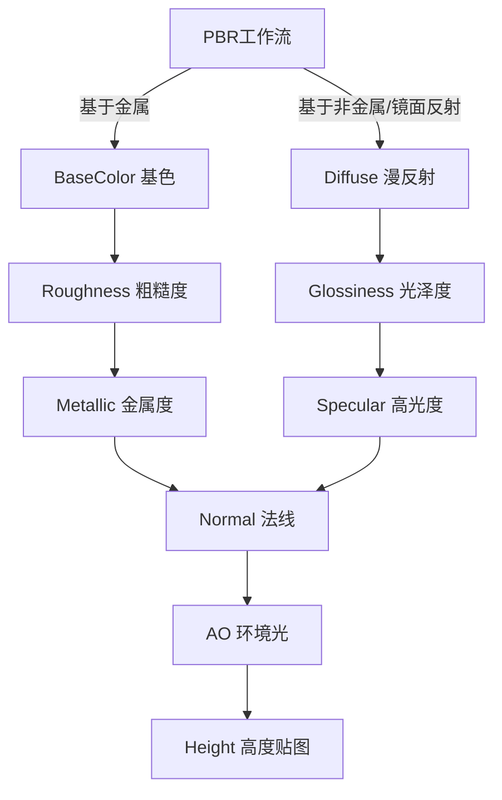

# UE5材质

> | 序号 | 课程                                                         | 作者       | 链接                                                         | 备注                                                         |
> | ---- | ------------------------------------------------------------ | ---------- | ------------------------------------------------------------ | ------------------------------------------------------------ |
> | 1    | Introduction to Materials in Unreal Engine 5                 | Mao Mao    | [Udemy](https://www.udemy.com/course/introduction-to-materials-in-unreal-engine-5/) | [b站](https://www.bilibili.com/video/BV1kvDsBAEGz?spm_id_from=333.788.videopod.episodes&vd_source=9a146b8fa39d5ea05ce3a524dcff45d4) |
> | 2    | PBR材质底层原理讲解                                          | 嗜睡的猫咪 | [b站](https://www.bilibili.com/video/BV1oY4y1t717)           |                                                              |
> | 3    | PBR材质用法及讲解                                            | 王瑞琪     | [b站](https://www.bilibili.com/video/BV1jg411n7vA)           |                                                              |
> | 4    | 【PBR材质贴图】最全详解和使用（新手入门篇-表面贴图，AO，粗糙度，凹凸，法线，置换，透明贴图） | Nora仙仙仙 | [b站](https://www.bilibili.com/video/BV1Rx4y1o75r)           |                                                              |

### 0.待分类

#### 1.模型 Model

模型是用数据结构进行严格定义的三维物体或虚拟场景的描述它包括几何、视点、纹理、照明和阴影等信息。

#### 2.次表面散射 Microsurface scattering

次表面散射是光线进入物体后，在内部的反弹和吸收，再有很少部分光线从表面射出呈现一种半透明效果。

#### 3.HDR色彩理论

通过网站将PNG格式转换为HDR格式，立方体纹理：https://convertio.co/zh/

优化设置三步：确保功能正常，提升画质避免压缩，保证流畅

- Mip生成设置：NoMipmaps
- 纹理组：Skybox
- 压缩设置：Userlnterface2D (RGBA) 

天空材质标准做法：

- 无光照材质：天空不应该与光照系统交互，避免产生倒影和反射
- 添加TextureSampleParameterCube
- 添加反射向量节点ReflectionVectorWS
- 添加RGB来控制天空盒旋转

#### 4.漏光现象

#### 5.快捷键

> 快捷键：S + 左键
>
> 介绍：快速创建变量

### 1.基础理论

#### 1.1 材质 Material

解释：材质基本上就是涂在物体表面的颜料，形态各异。

比如陶瓷，玻璃，草，水等，你能看到的所有物体都有材质。

材质是定义UE5中物体表面视觉特性的核心组件，可控制模型的颜色、反光强度、粗糙程度、透明度等外观属性，确保模型在不同光照环境(如日光、室内光)下呈现符合现实逻辑的视觉效果，是连接模型几何与最终渲染画面的关键环节。

- 着色器:承载光线与材质交互的计算逻辑，决定光线如何反射、折射或吸收，是材质的运算核心
- 贴图:通过图像承载细节信息，弥补模型几何精度不足，常见类型包括基础色贴图、法线贴图、粗糙度贴图等。
- 参数:可调节的数值或开关(如金属度数值、自发光强度)，用于快速修改材质效果，无需重构节点网络。

#### 1.2 贴图 Mapping

纹理贴附模型的过程+视觉效果

核心技术:UV映射
特性:依附模型，无法独立存在

广义上是将纹理通过UV坐标贴附到3D模型表面的完整操作过程;狭义上可指“纹理应用到模型后的最终视觉效果”。

它是连接2D纹理与3D模型的关键环节，核心依赖UV映射技，沒有3D模型和UV坐标，贴图就无法实现。比如把木纹纹理贴到UE5的立方体模型上，这个操作及立方体表面呈现的木纹效果，就是贴图。

|  对比维度   |                     纹理Texture                     |                         贴图Mapping                          |
| :---------: | :-------------------------------------------------: | :----------------------------------------------------------: |
|  本质属性   |       静态的数字图像文件/资源，是静态数据载体       |       动态的应用过程+最终视觉结果，是操作与效果的结合        |
|  存在形式   | 可单独存储(如本地文件夹，UE5资源管理器)，不依赖模型 |             必须依附3D模型和UV坐标，无法独立存在             |
|  核心作用   |        提供颜色、凹凸、粗糙度等基础细节数据         |         实现2D纹理到3D模型的适配，让模型呈现真实质感         |
| UE5中的体现 |   导入后显示为Texture2D/3D资源，可在资源面板预览    | 在材料碧娜机器中通过UV节点、纹理采样节点实现，最终在视口/场景中呈现效果 |
|  关联关系   |     是贴图的前提和基础，五纹理无法进行贴图操作      |         是纹理的引用方式和结果，纹理通过贴图发挥作用         |

#### 1.3 纹理 Texture

独立数字图像资源，存视觉数据

格式:TGA/PNG/EXR等特性:不依赖模型，可单独存储

本质是存储视觉细节数据的独立数字图像资源，是UE5材质系统的基础数据载体，格式多为TGA、PNG、EXR等，可在项目文件夹中单独管理和存储。
它不仅包含颜色信息，还能承载凹凸、粗糙度、金属性等各类细节数据，无需依赖3D模型可存在。例如电脑本地保存的一张木纹图片，就是一张独立的纹理。

- 纹理导入UE5后，需在材质编辑器中通过“纹理采样节点”调用，再与材质输出、混合等节点连接，才能应用到模型上。
- 避免纹理重复感:大面积模型(如地面、墙面)可开后纹理“平铺”功能，或用“纹理混合”节点叠加多张纹理，提升视觉丰富度。
- 通道打包纹理需先拆分再使用:通过Component Mask节点选择对应通道(如R=粗糙度、G=金属度)，再连接到材质表达式节点。

#### 1.4 渲染 Render

在电脑绘图中，是指以软件由模型生成图像的过程。

模型是用数据结构进行严格定义的三维物体或虚拟场景的描述它包括几何、视点、纹理、照明和阴影等信息图像是数字图像或者位图图像。渲染用于描述:计算视频编辑软件中的效果，以生成最终视频的输出过程。
$$
\Large\textbf{渲染方程} \\
L_o(x, \vec{w}) = L_e(x, \vec{w}) + \int_{\Omega} f_r(x, \vec{w}', \vec{w}) \, L_i(x, \vec{w}') \, (\vec{w}' \cdot \vec{n}) \, d\vec{w}'\\

L_o(x, \vec{w})：在特定位置x及角度\vec{w}的出射光。\\
L_e(x, \vec{w})：在同一位置及方向发出的光。\\
\displaystyle \int_{\Omega} \dots d\vec{w}'：入射方向半球的无穷小累加和。\\
f_r(x, \vec{w}', \vec{w})：在该点从入射方向到出射方向光的反射比例。\\
L_i(x, \vec{w}')：该点的入射光位置及方向 \vec{w}'。\\
(\vec{w}' \cdot \vec{n})：入射角带来的入射光衰减。
$$

​	它的两个很显然的特性是:线性和空间同质性。由于只有乘法和加法运算，所以是线性的;由于在所有的位置和方向都一样，所以具有空间同质性。这也就意味着方程的解可以有很大范围的因数与排列。渲染方程是渲染领域中的一个核心理论概念，它是渲染中不可感知方面的最抽象的正式表示。
​	在一个特定的位置与方向，出射光L。)是发射光L。与反射光之和。反射光是所有方向入射光之和L乘以表面反射率及入射角。通过交叉点，这个方程将入射光与出射光联系在一起，它代表了场景中完整的光线传输即光线的所有运动。

何为真实?
物体看起来是什么质地，材质可以看成是材料和质感的结合。材质在渲染方程式中，它是表面各可率、发光度等。视属性的结合，这些可视属性是指表面的。色彩、纹理、光滑度、透明度、反射率、折射。

#### 1.5 反射/漫反射 Reflection/Diffusion

光的反射是镜面反射(类似镜子)或漫反射(角度散射)

理想的漫反射表面会表现出朗伯反射，这意味着从与表面相邻的半空间内的所有方向观察时，亮度相等。

在物体内部反射的认为是散射，射出的是漫反射。

漫反射是进入物体内部折射之后出来的组合光才是漫反射光。

PBR体系认为任何物体表面都不是光滑的

金属没有漫反射，因为金属是由阳离子和自由电子组成的，进入金属内部的光子会被自由电子完全吸收，无法再反射出来，没有反射/散射就没有漫反射。

金属的漫反射为0，只考虑反射信息。非金属的反射由光源决定，只考虑反射强度。

(反射颜色，每种金属的物理特性)金属漫反射0，只考虑反射信息。非金属的反射由光源决定，只考虑反射强度。

本质上说明了为什么会有金属工作流和非金属工作流两种情况。

金属反射的颜色，是由他吸收完后其他反射出来的颜色决定。非金属是由照射他的光的颜色决定。

#### 1.6 半透明和透明 Translucency and transparency

在光学领域，透明度是允许光穿过材料而没有明显的光散射的物理特性。散射就是漫反射。

半透明材料由具有不同折射率的成分组成。
透明材料由具有均匀折射率的成分组成。

金属没有漫反射，因为金属是由阳离子和自由电子组成的，进入金属的光子会被自由电子吸收无法反射出来。

光本身就是电磁波，
光具有波粒二象性。

​	人眼可识别可见光仅仅是电磁波谱里的一小部分，波长分布在380nm-750nm。们将看到它体现出黑色，如果它吸收掉一部分可见光，那如果我们看到的物质吸收所有的可见光，那我我们将看到它的互补色。

在宏观尺度上(尺度远大于相关光子的波长)可以说光子遵循斯涅尔定律。半透明(也称为半透明或半透明)允许光通过，但不一定(同样，在宏观尺度上)遵循斯涅尔定律;光子可以在两个界面中的任何一个处散射，也可以在折射率发生变化的内部散射。

次表面散射是光线进入物体后，在内部的反弹和吸收，再有很少部分光线从表面射出，呈现一种半透明效果。

#### 1.7 PBR理论 

> 全称：Physically Based Rendering 基于物理的渲染
>
> 定义：PBR基于物理的渲染是一种计算机图形学方法，旨在模拟现实世界中光和物体的真实交互。
>
> 发展：2012年迪斯尼技术论坛，PBR技术流程11个参数。2014年优化到3个参数并提出理论：一切物体都有反射。

| P—Physics | B—Base | R—Rendering |
| --------- | ------ | ----------- |
| 物理      | 基于   | 渲染        |

实现原理：

- BRDF双向反射率分布函数（虚幻目前使用的就是BRDF）
- BTDF双向透射率分布函数
- BSDF双向散射率分布函数 = BRDF + BTDF
- BSSRDF双向次表面散射反射分布函数 = BSDF + 3S材质

定义

- 基于微表面
- 基于能量守恒
- 基于BRDF

##### 1.7.1  PBR工作流示意图

来源：[The PBR Guide](https://www.adobe.com/learn/substance-3d-designer/web/the-pbr-guide-part-2?learnIn=1&ntd=1)

- 金属的漫反射为0，只考虑反射信息。
- 非金属的反射由光源决定，只考虑反射强度。

会产生两种工作流的原因，是金属与非金属反射原理的不同[详细参考反射部分]

金属没有漫反射，所以才设计了反照率

| 名称                                                         | 中文         |
| ------------------------------------------------------------ | ------------ |
| Reflection                                                   | 反射         |
| Diffusion                                                    | 漫反射       |
| Translucency and transparency                                | 半透明和透明 |
| Conservation of energy                                       | 能量守恒     |
| Metallicity                                                  | 金属性       |
| Fresnel reflection                                           | 菲涅尔反射   |
| Subsurface scattering（注：原词 Microsurface 为笔误，应为 Subsurface） | 次表面散射   |

PBR体系认为任何物体表面都不是光滑的

能量守恒 Conservation of energy
金属性 Metallicity
菲涅尔反射 Fresnel reflection
次表面散射 Microsurface scattering

特殊工作流

- 非金属
  - 2张RGB
  - F0值 = 折射光线/反射光线
- 金属
  - F0值为0.04

#### 1.8 RGBA

| PNG  | RGBA/RGB |
| ---- | -------- |
| JPG  | RGB      |

红/绿/蓝/透明通道，支持多纹理打包

通道特性:0-255灰度值，存储单值信息

RGBA通道:纹理的核心数据存储载体，是实现多纹理合并存储的关键，下文重点详解。

在UE5开发中，RGBA通道本质是4个独立的8位灰度通道(红Red、Green、蓝Blue、透明Alpha)，每个通道仅存储黑白灰信息，可分別承载不同类型的纹理数据。通过通道打包将多张单通道纹理合并为一张纹理，能减少资源数量、降低DrawCall，大幅优化项目性能。

RGBA通道基础特性

- 每个通道取値范围为0-255，对应灰度从纯黑(0)到纯白(255)，可精准存储粗糙度、金属度、遮罩等单値信息。
- 仅支持存储无颜色依赖的纹理类型，漫反射纹理(带彩色信息)不适合通道打包，法线纹理因需特殊压缩也极少参与
    打包。
- 合并后的纹理格式需选择支持Alpha通道的类型(如TGA、EXR、PNG)，确保Alpha通道数据不丟失。

UE5中常用RGBA通道打包方案
通道分配需遵循“高频使用优先、逻辑关联优先”原则，以下为最常用的组合方式，适配多数开发场景:

#### 1.9 3S材质

3S材质也叫次表面散射材质Sub-Surface Scattering，简称 SSS，是3D渲染中用于表现半透明效果的高级材质 。

原理：光线进入物体内部经过散射、吸收后再从表面射出，形成透光不透明的视觉效果 。‌‌

#### 1.10 sRGB

sRGB是色彩空间，只有 BaseColor/Albedo 贴图需要开，Height、Normal、ORM、Mask 这类数据图必须关。

sRGB 是一种带伽马矫正的色彩空间，目的是让显示器显示的颜色和人眼感知一致。

sRGB 是由微软和惠普于 1996 年共同开发的色彩空间标准。

不代表颜色的都需要关掉。

在引擎里，它是一个至关重要的开关：

- 开启 sRGB (True)： 告诉引擎“这是一张给人眼看的颜色图（如 Base Color/颜色贴图）”。
- 关闭 sRGB (False)： 告诉引擎“这是一张给显卡算的数据图（如 Normal/法线、ORM/通道图）”。

起源：

​	几十年前的老式大头显像管电视CRT屏幕有个物理缺陷：你给它 50% 的电压，它渲染出来的亮度并不是 50%，而只有大约 20%。这种输入电压和输出亮度不对等的物理特性，在数学上被称为 Gamma2.2曲线。

​	巧的是，人类的眼睛也恰好有类似的缺陷。人眼对暗部细节非常敏感，但对亮部细节很不敏感（在黑屋子里多一根蜡烛你能明显感觉到，但在大太阳底下多一根蜡烛你根本注意不到）。

为了让图片在当时有缺陷的显示器上看起来正常，并且符合人眼的感官，微软和惠普在 1996 年联合制定了一个标准，叫做 sRGB。

- 它的做法是：把图片刻意调亮（做一次反向修正，也就是 Gamma 0.45）。
- 这样，图片在被显示器压暗（Gamma 2.2）之后，两边一抵消，人眼看过去就正好变成了完美的线性正比亮度。

直到今天，我们日常在网上看到的 JPG、PNG、手机拍的照片，默认全部都是开启了 sRGB 的。

​	在现代游戏引擎（UE5、Unity 默认）内部，所有的光照、阴影、反射，都是基于物理世界真实的数学公式去计算的。物理计算必须在 线性空间Linear Space里进行。线性空间的意思就是：$1 + 1 = 2$。两盏亮度为 1 的灯，照在一起必须是 2 的亮度。

这就产生了一个巨大的冲突：

冲突 A：如果是 Base Color（颜色贴图）

你下载了一张木纹的 BaseColor.png。因为它是普通图片，它自带 sRGB（被刻意调亮了）。

1. 如果不处理直接拿去计算： 引擎的光照公式（线性）去乘以这张调亮过的图，算出来的光影就会彻底崩坏，画面看起来会惨白一片。

2. 引擎的处理方式： 当你在引擎里勾选 **`sRGB = True`** 时，引擎会说：“懂了，你是颜色图。” 引擎会在渲染前，悄悄把这张图压暗复原（移除 sRGB），用纯净的数据去参与光照计算。计算完要输出到你的显示器上时，再统一调亮（加上 sRGB）。

   这就是为什么颜色图必须开启 sRGB。

冲突 B：如果是 ORM / Normal（数据贴图）

现在回到你正在做的这张 ORM 贴图。

- 你的 R 通道里连的是 AO（环境光遮蔽），数值 0.5 代表遮蔽率是 50%。
- 你的 G 通道里连的是 Roughness（粗糙度），数值 0.8 代表这地方有 80% 的粗糙。

这些数值是纯粹的数学符号，是直接给引擎的着色器（Shader）当公式里的乘数用的，它们根本不需要拿给人的眼睛看，也从来没有经过老式显示器的“荼毒”！

如果你错误地开启了 sRGB（True）：

引擎就会误以为它是一张“人眼看的颜色图”，在后台自作聪明地用 Gamma 算法把这张图强行压暗了再去参与计算。

- 结果就是：你原本设置的 0.5 的粗糙度，被引擎当成了 0.2 去算；0.8 的金属度，变成了 0.5。
- 最终反映在游戏里：你的模型材质看起来莫名其妙地巨亮、反射极其诡异、或者金属不像金属，塑料不像塑料。

#### 1.11 饱和度

在计算机中，要把彩色变黑白，本质上是把 RGB 三个通道的数值趋向于同一个平衡点。

当 R = G = B 时，像素就不再呈现任何色相，而是表现为灰色。

常用的算法并不是简单的 $(R+G+B)/3$，因为人眼对不同颜色的亮度感知不同（对绿色最敏感，对蓝色最钝）。经典的去饱和度权重公式通常是：
$$
Luminance = R \times 0.299 + G \times 0.587 + B \times 0.114
$$
​	我们需要先打破一个直觉：颜色其实并不存在于物理世界中，它只是你的大脑对不同波长光线的翻译。我们的眼睛里有三种感知颜色的细胞（锥状细胞），分别对红、绿、蓝波长的光最敏感。彩色是怎么产生的？当进入眼睛的光线中，某种波长的能量显著高于其他波长时（比如红色能量远大于绿和蓝），大脑就会告诉你：“这是红色”。黑白是怎么产生的？当红、绿、蓝三种光线的能量完全平衡R = G = B时，你的三种感光细胞受到的刺激是均等的。大脑无法分辨出任何偏向性，这种“无色彩偏向”的状态，在人类的感知中就被定义为灰阶Grayscale。

​	你的眼睛接收到的红、绿、蓝信号是完全均衡的。大脑无法区分哪个多哪个少，就无法识别出具体的 “色相”（比如红、黄、蓝），大脑会判定这是一种中性色。

#### 1.12 BRDF 双向反射分布函数

> 作用：定义光在不透明表面上的反射方式

处理PBR表面通常依赖于双向反射分布函数BRDF的简化模型，该模型可以快速计算，并且仅使用少量直观参数就可以很好地近似材料的光学特性。
$$
f_r(\omega_i, \omega_r)
= \frac{dL_r(\omega_r)}{dE_i(\omega_i)}
= \frac{1}{L_i(\omega_i)\cos\theta_i} \frac{dL_r(\omega_r)}{d\omega_i}
$$
​	双向反射分布函数(BRDF;fr(w1,w)是四个实变量的函数，定义了光在不透明表面上的反射方式。它用于现实世界光的光学、计算机图形算法和计算机视觉算法。该函数采用入射光方向，w,和(在表面法线所在的坐标系中拍传出方向，摄沿轴)，并返回沿z轴出射的反射辐射率的比率从方向入射到表面上的辐照度w.每个方向w本身由方位角参数化中和天J顶角B,因此BRDF作为一个整体是4个变量的函数。BRDF具有单位sr,,球面度(s)是立体角的单位。

#### 1.13 BSDF

出自Blender材质着色器

#### 1.14 朗伯反射

#### 1.15 对比度 Contrast

#### 1.16 菲涅尔反射 Fresnel Reflection

光线入射角度不同，材质反射率会变化:
1.垂直入射(正视材质):反射率低，金属/非金属差异明显(金属反射强，非金属反射弱);
2.掠射入射(斜看材质):无论金属/非金属，反射率都会显著提升(如斜看水面时反光更强)。

万物皆有菲涅尔效应

- 视线垂直于表面时，反射较弱
- 视线非垂直表面时，夹角越小，反射越明显

不过这种过度关系被折射率影响

国外非常著名的光学常数数据库网站RefractiveIndex.INFO：https://refractiveindex.info/?shelf=3d&book=liquids&page=water

#### 1.17 Nanite

#### 1.18 HDR环境贴图

- 使用HDR环境贴图:在UE5【世界设置】中导入HDRI贴图(如天空盒)，确保PBR材质反射环境细节，避免“反光空
    洞”;
- 开启屏幕空间反射:在[项目设置】-[渲染】中开启 “Screen Space Reflections”，增强金属、光滑材质的反射真实度(注意:低配置设备需权衡性能)。

#### 1.19 立方体贴图 Cube Map

输入:纹理端口用于加载CubeMap资源，无需二维UV数据，需一个三维向量端口(三向量UVs)接收方向数据，该数据通常来自“相机向量”或“世界法线”等节点。
输出:包含RGB端口(输出环境反射颜色)和Alpha端口(输出透明通道，部分CubeMap可用)。
用途:模拟环境反射效果，例如金属球反射周围场景、玻璃表面的环境映射等，让材质与场景环境更融合。
UVs使用三向量的原因:Cube Map本质是六个正方形纹理组成的立方体，需通过三维空间方向向量定位采样点--向量从模型表面采样点出发，指向CubeMap立方体某个面，进而获取环境纹理颜色。二维UV仅能定位平面点，无法满足立方体空间采样需求，因此必须用三向
量。

#### 1.20 曲面细分

#### 1.21 反射IOR

非金属：真实世界不大于3

金属：

与菲涅尔反射有关系

控制反射信息

### 2.PBR贴图

#### 2.1 基础颜色贴图 BaseColor Map

> 别称：漫反射贴图 Diffuse Map，表面贴图，颜色贴图
>
> 作用：定义模型的基础颜色，不包含光影信息，最核心的基础纹理。

| 名称      | 又称   | 参考后缀 | 通常代表    | 时期                   | 备注                                       | 历史                                                       |
| --------- | ------ | -------- | ----------- | ---------------------- | ------------------------------------------ | ---------------------------------------------------------- |
| BaseColor | 基色   | T_XXX_B  | 金属/非金属 | UE，目前主流           | 同时包含金属的反照率和非金属的颜色信息     | 从UE4开始作为官方材质节点名，最符合UE工作流的叫法          |
| Albedo    | 反照率 | T_XXX_A  | 金属/非金属 | 现代PBR体系            | 金属/非金属的反照率，当金属度为0时=Diffuse | 物理固有色，PBR的标准术语，BaseColor的学术叫法             |
| Diffuse   | 漫发射 | T_XXX_D  | 非金属      | 早期游戏渲染的传统叫法 | 非金属颜色                                 | 旧光照时代的产物，早期Diffuse贴图常包含烘焙光影AO,是错误的 |

再次强调：在现代PBR中BaseColor/Albedo//Diffuse是同一概念。

当存在Alpha通道时，Alpha通道负责控制材质透明度，0为完全透明，1为完全不透明。

再次强调

- 在现代PBR流程中，BaseColor被要求是纯粹的物理反照率。
- Diffuse在旧渲染模型中，不仅包含颜色，还包含了一些伪造的光影细节。
- 当金属度为0的时候：Albedo = Diffuse
- Albedo无论在金属还是非金属上都存在，它是一个物理总称

基础颜色贴图是一种基础纹理，可以叫做表面纹理，或颜色贴图，是一种赋予模型表面颜色的贴图属性，也是最直观的材质贴图--表面贴图相对比较随意，网络图或自己拍摄的图亦可当作是表面贴图

#### 2.2 金属度贴图 Metallic Map

> 作用：是不是金属
>
> 色彩特征：白色金属，黑色非金属
>
> 别称：Mask
>
> 备注：一个物体同时存在金属和非金属才需要贴图，否则直接用数值调节就可以

基于PBR理论的核心三要素

控制：反射颜色是环境色，还是自身颜色

注意：当金属度为1的时候高光度会完全由金属度控制而失效

| 参数 | 表现             | 含义                  | 参考                 |
| ---- | ---------------- | --------------------- | -------------------- |
| 0    | 非金属           | 仅反射环境颜色        | 塑料、石头、布、皮肤 |
| 0~1  | 介于金属与非金属 | 反射带环境0/自身1颜色 |                      |
| 1    | 纯金属           | 仅反射自身颜色        | 铁、钢、铝、铜、金   |

金属度纹理(MetallicMap):区分物体是否为金属材质，以黑白灰渐变表示，白色为纯金属，黑色为非金属。

功能:控制物体金属质感强度，决定材质是否具备金属特有的反光特性。
调节方式:0-1数值调节，0对应非金属(木材、布料)，1对应纯金属(钢材、铝材)，中间値为半金属质感(合
金

一个区域同时存在

#### 2.3 高光度贴图 Specular Map

> 别称：反射贴图 Reflection Map，SPEC
>
> 色彩特征：白色反射，黑色不反射

基于PBR理论的核心三要素

解释：表面光滑程度，决定反射是清晰还是模糊

控制：反光的聚散程度、反射清晰度

注意：ORM打包情况下是不存在高光度的，因为这是一个推导值，非金属是0.04也就是默认值0.5，而金属是由金属度决定的。

当金属度为1的时候高光度会完全由金属度控制而失效，原因是BRDF公式中的F项的小项F0所导致如下
$$
f(l, v) = \frac{D \cdot F \cdot G}{4 \, (\omega_i \cdot n) \, (\omega_o \cdot n)}
\quad
\begin{aligned}
D&:\text{法线分布} \\
F&:\text{菲涅尔} \\
G&:\text{几何遮挡}
\end{aligned}
$$

| 参数 | 表现     | 含义           | 参考             |
| ---- | -------- | -------------- | ---------------- |
| 0    | 镜面光滑 | 反射锐利清晰   | 镜子、抛光金属   |
| 0~1  | 半粗糙   | 反射柔和模糊   | 拉丝金属、磨砂面 |
| 1    | 完全粗糙 | 无明显镜面反射 | 铁锈、粗糙石材   |

#### 2.4 粗糙度贴图 Roughness Map

> 相反：光泽度贴图 Glossiness Map
>
> 别称：ROU

基于 PBR 理论的核心三要素

解释：非金属材质的反射光强度

控制：非金属反射多少光线，金属基本不受影响

| 参数 | 表现     | 含义     | 参考       |
| ---- | -------- | -------- | ---------- |
| 0    | 无高光   | 不反射   | 哑光布     |
| 0.5  | 标准高光 | 常规反射 | 塑料、皮肤 |
| 1    | 极强高光 | 镜面反射 | 宝石、釉面 |

粗糙度纹理(Roughness Map):控制物体表面的光滑程度与光线反射效果，白色代表粗糙，黑色代表光滑。

功能:调节物体表面光滑度，影响光线反射
的清晰度与柔和度。
调节方式:0-1数值调节，0为镜面光滑(高反光，如玻璃)，1为磨砂粗糙(弱反光，如布料)。

输入:与基础纹理一致，包含纹理端口(加载粗糙度贴图资源)和UV端口(接收二维UV数据)。
输出:主要使用RGB端口(因粗糙度贴图为灰度图，R、G、B通道数値相同)，输出0到1范围的标量数据，数値越高代表材质表面越粗糙，数值越低则越光滑。

用途:精细化控制材质表面的粗糙程度分布，例如金属零件的哑光区域与高光区域可通过该贴图精准区分，让材质质感更員实。

通过该效果的黑白，造成光漫射的表面不规则状况，反射方向根据表粗粗糙度是指贴图存在划痕，污渍，等等磨损的效果不变。表面越粗糙，高光越散越暗。表面越光滑，高光反射集中，尽管面粗糙度自由变化。这改变了光的方向，但是光强度保持恒定较粗糙的表面会得到更宽阔更模糊的镜面反射(高光)，而一个比较光反射的光的总量是一点的，表面也会更亮，光会更强。一个比!滑的表面则会得到集中而清晰的镜面反射。黑色地方表示光滑，白色地方表示粗糙。

#### 2.5 自发光贴图 Emission Map

自发光纹理(控制模型发光区域)、遮罩纹理(控制材质局部显示/隐藏)等。

#### 2.6 法线贴图 Normal Map

> 作用：展示高度细节，改变光线在表面的反射方向，不对模型造成物理形变
>
> 别称：NRM/NOR

解释：法线贴图是从不同视角观察到的打光信息

- R是从右往左打光
- G是从下往上打光
- B是从外往里打光

但是因为是单位向量，所以可以计算的得出可以减小存储空间。

内容：法线确实是三维向量 $(x, y, z)$，但是由于法线是单位向量长度等于1，所以通过数学可以压缩三维到两维，来节省空间。还有关于法线的方向问题，法线是切线空间所以规定始终向上
$$
由\quad R^2 + G^2 + B^2 = 1 \\
得\quad B = \sqrt{1 - R^2 - G^2}
$$
引擎自带：Engine/Content/EngineMaterials/DefaultNormal，该贴图在虚幻引擎至少可以追溯到UE4。在当时的开发环境下，这张图被设计成带有一点点微妙的表面质感，用来模拟最基础的物体表面。

标准默认的法线就是(0,0,1)其实只使用RG两个参数即可。

BC5压缩就是两通道，

传统常规就是三通道

增强法线就是控制凹凸深度的放大倍率，放大这两个向量的偏移量

法线方向 = 高度场的梯度（变化率）

- 高度变化越剧烈 → 法线方向越倾斜
- 高度越平坦 → 法线越接近垂直（0,0,1）

法线纹理(NormalMap):核心用于模拟物体表面的凹凸细节，且不增加模型几何面数，极大优化性能，如墙面裂纹、皮革褶皱等效果。

输入:除纹理端口(加载法线贴图资源)和UV端口(接收二维UV数据)外，需在节点细节面板将“采样模式”设为“法线贴图”，确保数据正确解析。
输出:专用的法线端口，输出三维向量数据，用于模拟模型表面的微小凹凸结构，无需修改模型本身的几何形状。
用途:在不增加模型面数的前提下，为模型添加丰富的细节层次，例如布料的褶皱、皮革的纹理颗粒等，提升模型视觉表现力。

浮雕映射视差算法PBR着色器中的纹理采样器

​	法线贴图是紫色的，是最好辨认的，和凹凸差不多，不过凹凸通道是通过灰度图是描述凹凸的程度，而法线是由颜色散射去描述凹凸的程度。所以法线相对会比凹凸效果好一些。在有很多贴图的情况下，并没有必要全部都贴，而是自己选择。

#### 2.7 环境光遮蔽贴图 Ambient Occlusion Map

> 别称：AO/OCC
>
> 作用：表面某点能获得多少环境中的光

环境光遮蔽贴图是指表面某点能获得多少环境中的光。该贴图只影响漫反射分配，不影响高光反射分配。

我们主要用它来解决漏光现象，以及处理光线在细节处表达不清晰的情况例如，沟壑，缝隙、褶皱，墙角、角线等。通过改善细节和暗部阴影来增加空间的层次感跟真实感

使用方法：

- AO贴图 + 漫反射贴图：增加暗部细节
- AO贴图 + 置换/凹凸贴图：增加凹凸对比

​	光线的遮蔽信息，指表面能获得多少环境中的光，用来模拟物体之间所产生的阴影，在不打光的时候增加体积感，环境光遮明越弱这一现象来模拟现实照明的一部分效果。该贴图只影响漫反射分蔽贴图基于物体与其他物体越接近的区域，受到反射光线的照
配，不影响高光反射分配。

闭塞阴影

#### 2.8 高度贴图 Height Map

> 色彩特征：黑是凹陷，白是凸起

​	高度贴图属于PBR形变贴图。PBR形变贴图是一些特殊的纹理，允许为模型添加表面细节，例如凸起、凹槽和划痕，这些细节将捕获光线，就像真实的几何体一样。如果在游戏引擎里用模型来表现凹凸细节，将需要绘制非常多数量的多边形，以现在的电脑耗不起，如果使用一张贴图来呈现细节，将会更简单，除了法线外，其他形变贴图通常都是黑白的，白色的地方代表凸起，黑色的地方是凹陷。这些细节将捕获光线，就像真实的几何体一样。

​	PBR形变贴图包括，法线，置换，高度，凹凸可以相互更换使用，都是灰度图。

| 名称             | 又称     | 后缀          | 简述             |
| ---------------- | -------- | ------------- | ---------------- |
| Height Map       | 高度贴图 | _H            | 提供高度信息     |
| Displacement Map | 置换贴图 | _Displacement | 真正改变模型顶点 |
| Bump Map         | 凹凸贴图 | _Bump         | 已弃用           |
| Normal Map       | 法线贴图 | _N            | 伪造表面凹凸     |

UE 里的高度贴图本身没有专用节点输入。置换效果Displacement，需要配合曲面细分Tessellation和World Displacement才能生效。

用Power 节点是用来强化高度图对比度，因为Multiply整体变等于没变，需要调整的是各部分比例。

调整高度的对比度，让层次更分明，或者让过渡区更陡峭/平缓。

|     维度     |           法线/凹凸贴图 Normal/BumpMap           |               置换贴图 DisplacementMap               |
| :----------: | :----------------------------------------------: | :--------------------------------------------------: |
|   核心原理   | 像素级光影欺骗。修改表面法线方向来模拟光照起伏。 |     顶点级物理变形。根据灰度值实际位移网格顶点。     |
|  几何体变化  |         无。原始模型多边形数量保持不变。         |       有。需要极高密度的多边形或动态细分支持。       |
|   轮廓表现   |   边缘永远是平滑的直线（所谓的“剪影”是破绽）。   |       边缘会产生真实的起伏，完美贴合模型轮廓。       |
|   阴影效果   |     只有明暗对比，无法产生真实的自遮挡阴影。     |    凸起部分可以遮挡光线，并在凹陷处产生真实投影。    |
|   性能损耗   |      极低。是目前所有实时渲染器的标准配置。      | 很高。极度消耗显存和计算资源（即便有 Nanite 支持）。 |
| 最佳应用场景 |     细小纹理：皮肤毛孔、布料纤维、金属划痕。     |        宏观结构：乱石堆、砖墙深度、山体地貌。        |

高度贴图（通常是一张黑白图）在现代引擎里并没有消失，但它不再拥有材质面板上的独立连线槽。它通常有以下两种宿命：

1. 用于视差贴图（POM - Parallax Occlusion Mapping）： 在材质蓝图里，如果你想做砖缝、地表那种极深的立体感，可以用节点引入这张高度图，做一个“视差遮蔽”效果（一种高级的纯像素视觉欺骗，比置换省性能）。
2. 作为融合掩码（Blend Mask）： 在多层材质融合（比如石头上刷青苔）时，利用高度图的黑白像素让青苔顺着石头的缝隙自然长出来。

Height现在还有什么用？

主要是材质混合。例如：泥土覆盖石头。

所以很多Megascans材质仍然会带Height。但不是为了Displacement。

高度图（Height）多数时候只用于材质混合或特殊效果；真正的Displacement已经被Normal和Nanite大量取代了。

##### 2.8.1 置换贴图 Displacement Map

> 别称：移位贴图
>
> 色彩特征：黑是凹陷，白是凸起
>
> 别称：DISP/Height

会改变表面法线。

​	也叫做移位贴图，可以使物体产生凹凸的通道，只是假象起伏形变，该通道会让物体发生真实的形变，而不只是模拟。当然，并不会破坏原来的模型，但要达到较好的置换效果需要提高模型本身的顶点数细分。

置换贴图是真正的性能杀手。

- 它的本质是： 它是唯一一个真正去改变模型网格几何形状（移动顶点）的贴图。
- 传统的痛点（Tessellation）： 在传统的 PBR 流程（如 UE4 时代）中，置换必须依赖曲面细分**（**Tessellation**）**。这意味着引擎要把一个原本 100 个三角面的石头，在运行时暴力拆解成 10000 个面，然后再根据置换贴图把顶点拔高。这会给显卡带来极为恐怖的顶点计算压力，通常只敢用在主角衣服、核心道具或者主角脚下的核心地面上。

##### 2.8.2 凹凸贴图 Bump Map

> 已弃用，被法线替代
>
> 色彩特征：黑是凹陷，白是凸起
>
> 别称：Height

单通道灰度图，用黑白灰表示高低—— 白凸、黑凹，只扰动法线、不改模型几何，靠光照明暗骗眼睛。

是一种统称，也是一种元老级的技术

凹凸贴图的本质是欺骗眼睛。它通过修改模型表面的法线方向，改变光线照射在物体上的明暗分布，从而让平整的表面看起来有凹凸不平的细节（如砖墙的缝隙、皮肤的毛孔），而无需增加实际的模型多边形数量。

凹凸贴图。在 PBR 流程中，它通常被法线贴图（负责视觉凹凸）和高度贴图（负责深度细节）所取代。如果你在开发游戏或建模，直接关注 NormalMap即可，它是目前实现“凹凸感”最标准、最通用的手段。

- 早期：黑白灰度图，计算效率高但效果一般
- 现在PBR：法线贴图能表现更细腻、更准确的角度变化

​	凹凸是一个类似于法线贴图的概念，不过凹凸通道是通过灰度图是描述凹凸的程度，而法线是由颜色散射去描述凹凸的程度。通常大家也认为凹凸就是高度图及灰度图

​	这是十几年前在PBR诞生前的老技术，用灰度图来表示高低。因为计算效率和效果远不如法线贴图（RGB 三通道），所以现在游戏行业已经基本不用 Bump 贴图了，全被法线替代了。

#### 2.9 光泽度贴图 Glossiness Map

白色光滑黑色粗糙，光泽度贴图指的是造成光漫反射的表面不规则现象。

#### 2.10 Alpha透明贴图

> 别称：Translucency，Opacity，Alpha
>
> 色彩特征：黑透，白不透

不透明贴图：Opacity，更常用，基本上就是纯黑白色，对比强烈。

透明贴图：Translucency与不透明贴图反向，提供部分灰色来有一定的调节空间

该贴图其实分为两种，透明度贴图和不透明度贴图，其实我们平常更多使用的是不透明贴图，它和透明贴图的区别只在于颜色的反向而已。

还有一些不常有的，Glossiness (缩写Gloss,光泽度贴图)，Anisotropic Map(各向异性贴图)，Curvature(曲率贴图)，Thickness(厚度贴图)，Light Map(光照贴图)，Emissive Map(自发光贴图)，细节贴图。

### 3.工业知识

#### 3.1 ORM打包

ORM是基于PBR的一种推荐打包方式

| 名称 | 又称     | 后缀 | 时期 | 备注                                |
| ---- | -------- | ---- | ---- | ----------------------------------- |
| Mask | 遮罩贴图 | _M   | 早期 | 三通道分别是什么ORM贴图需要自行分辨 |
| ORM  |          | _ORM | 推荐 | O是环境光遮蔽，R是粗糙度，M是金属度 |

#### 3.2 材质实例

#### 3.3 函数封装 Creating Function

#### 3.4.LOD

为远处模型创建简化材质(如移除法线贴图、降低贴图分辨率)，提升场景运行帧率。

### 4.渲染节点

#### 4.1 基础节点

##### 4.1.1 节点Texture Sample

> 快捷键:T + LeftMouse

全称：纹理采样类节点

纹理采样节点是材质中应用各类贴图的核心，通过加载不同类型的纹理资源，输出对应数据以实现多样材质效果，不同纹理类型的输入输出特性及用途存在差异。
该节点的输入输出端口会根据加载的纹理类型自动适配，以下按常用纹理类型分别说明:

举例：基础纹理(如木纹、石纹)

- 输入：包含两个核心端口，纹理端口用于加载外部基础纹理资源;UV端口用于接收UV调整节点输出的二维UV数据，控制纹理在模型表面的显示位置。
- 输出：包含两个常用端口，RGB端口输出纹理本身的颜色信息;Alpha端口输出纹理的透明通道信息，可用于控制材质局部透明效果。
    用途:为模型附着基础图案，是最基础的纹理应用形式，例如给墙体贴砖纹、给家具贴木纹。
    

##### 4.1.2 节点TexCoord纹理坐标

> 快捷键：U + LeftMouse
>

将 2D 图片贴在 3D 模型上的一套坐标。

U：代表水平方向（横轴）。

V：代表垂直方向（纵轴）。

每个顶点（Vertex）都会存储一个 UV 坐标，范围通常是 0 到 1。

- 左下角是 $(0, 0)$。
- 右上角是 $(1, 1)$。
- 中间就是 $(0.5, 0.5)$。

在游戏开发中，一个模型可以拥有多套 UV

Index 0： 通常用于纹理贴图。它决定了贴图怎么铺。

Index 1：通常用于光照贴图。这套 UV 要求展开得非常完美，不能有任何重叠，专门接收引擎烘焙的阴影信息。

Index 2+：进阶玩法。比如在衣服上叠一层 Logo，或者给建筑做一套专门的污垢掩码。

UV 是由模型本身提供的。

这类节点专门用于调整纹理的UV坐标信息，输出适配的UV数据给纹理采样节点，解决纹理位置、动态效果等问题。

输入:无外部数据输入，参数均为内置可调，包括坐标索引(默认0对应模型的UV通道1)、平铺(控制纹理重复次数)、偏移(控制纹理位置偏移)。
输出:一个UV端口，输出二维UV坐标数据，为基础纹理、粗糙度贴图等需要平面定位的纹理提供原始位置信息。
用途:解决纹理拉伸、重复问题，例如将平铺参数设为2和2，可让纹理在模型表面横向和纵向各重复两次。

#### 4.2 计算节点

##### 4.2.1 节点Constant1/2/3Vector

> 快捷键：1/2/3 + LeftMouse

- 常量1向量节点:1维向量，仅传递单个数値，可用于单独控制Alpha通道透明度等单一参数。
- 常量2向量节点:2维向量，传递两个数值，适用于需要双参数控制的简易效果(如纹理UV偏移的X、Y轴微调)。
- 常量3向量节点:3维向量，对应RGB三色通道，可替代基础颜色节点快速输入固定色彩数値。
- 常量4向量节点:4维向量，对应RGBA四通道，同时传递颜色(RGB)与透明度(A)参数，是基础颜色节点的常用搭
    配节点。

调节方式:双击节点打开参数面板，手动输入对应维度的数値，数値范围0-1，适配材质属性参数需求。

##### 4.2.2 节点Add

> 快捷键：A + LeftMouse

输入:两个同类型端口，需同时接收标量与标量，或颜色与颜色数据，不能跨类型输入。
输出:一个与输入类型一致的端口，输出加减运算后的结果。

用途:加法可增强颜色亮度，例如将基础纹理颜色与低数值颜色叠加，让纹理更鲜亮;减法可降低颜色亮度，让纹理色调更暗淡。

##### 4.2.3 节点Multiply

> 快捷键：M

作用：常用混合两个颜色，调整平铺

原理：物理中的减色法，或者叫减色混合，即当光线照射到物体表面时，材质会吸收一部分特定波长的光，而反射剩下的部分。

举例：

- a.红色物体只反射红光，绿色物体只反射绿光，两色叠加，能反射的部分 = 红色反射率 × 绿色反射率。
- b.如果第一个材质吸收了50%的红光（反射率为 0.5），第二个材质又吸收了 50% 的红光，那么最终反射出来的红光就是 $0.5 \times 0.5 = 0.25$（即 25%）。

输入:两个同类型端口，常接收一个基础数据和一个比例数据，例如纹理颜色与标量值。

输出:一个与输入类型一致的端口，输出乘法运算后的结果。
用途:按比例调整数据强度，例如用标量0.5与自发光颜色相乘，可让发光效果减弱一半;将粗糙度贴图数据与标量1.2相乘，可
整体提升材质粗糙程度。

##### 4.2.4 节点Append

输入:多个同类型的标量端口，常见为2个或3个输入端口，输入的标量数据需为0到1范围的数値，端口数量决定输出向量的维度。
输出:一个向量端口，根据输入端口数量输出对应维度的向量数据，2个标量输入输出二维向量，3个标量输入输出三维向量，4个标量输入输出四维向量。
用途:将分散的标量数据整合为向量数据，适配需要向量输入的节点。例如将两个常量标量拼接为二维向量，连接到平移节点的“平移”端口，精准控制X轴和Y轴的移动速度;将三个标量拼接为三维向量，用于自定义法线方向或CubeMap的方向向量。

##### 4.2.5 节点Lerp

输入:三个核心端口，A端口接收第一个基准数据，B端口接收第二个基准数据，两个端口数据类型需一致(均为标量或均为颜色、向量);Alpha端口接收0到1范围的标量数据，用于控制插値比例。
输出:一个与输入基准数据类型一致的端口，输出A和B之间的线性插值结果。Alpha为0时输出A的原始数据，Alpha为1时输出B的原始数据，0到1之间则输出两者的过渡数据。
用途:实现两种数据的平滑过渡效果，例如用Alpha值控制两种纹理的混合比例，制作材质渐变效果;或调整颜色的过渡程度，让材质色调变化更自然。

##### 4.2.6 节点Panner

> 快捷键：P

输入:包含两个核心端口，“输入”端口接收纹理坐标节点输出的二维UV数据，是基础坐标来源;“平移”端口接收二维向量数据，控制纹理在横向(X轴)和纵向(Y轴)的平移方向及速度，向量数値越大，平移速度
越快。
输出:一个“输出”端口，传递经过平移调整后的UV数据，需连接到各类纹理采样节点的UV端口，实现纹理平移效果。
用途:实现纹理动态移动，例如流水流动、云层飘移、地面纹理滚动等，让静态材质呈现动态视觉。若要循环平移，需确保纹理边缘无缝衔接。

#### 4.3 高级节点

##### 4.3.1 节点ObjectScale

配合Mask的RG转换为UV输入到Texture中,适合地形墙面等情况。

##### 4.3.2 节点SlopeMask

SlopeMask 是一个基于表面法线与世界 / 局部空间方向夹角，生成遮罩的常用材质函数 / 节点，核心作用是：

- 识别模型表面的坡度 / 朝向，输出一张黑白遮罩
- 比如：只在朝上的面、朝下的面、或斜面上生成覆盖效果（苔藓、积雪、泥土）
- 你图里的用法，就是给Cover层做坡度控制，让覆盖层只长在特定朝向的面上。

在 UE 的底层逻辑里，SlopeMask 通常是利用 **World Normal（世界法线）** 和 **Up Vector（向上向量）** 进行点积运算得出的。

原理

- **输入**：
    - 表面法线（Normal）
    - 参考方向（通常是 `WorldUp`，即世界空间的 Y 轴 / 上方向）
    - 坡度控制参数（如 `MinAngle`/`MaxAngle`，控制遮罩生效的角度范围）
- **计算**：
    - 用 `Dot Product（点积）` 计算法线和参考方向的夹角
    - 把夹角映射成 0-1 的值，再用 `SmoothStep` 做软硬过渡
- **输出**：
    - 一张 0（黑，不生效）-1（白，生效）的遮罩，用来控制覆盖层的强度

##### 4.3.3 节点MatLayerBlend_Standard

它是UE材质系统里实现层级化材质Layered Materials的最核心节点， 就是在贴皮。是 UE 官方标准化的多层材质混合节点

它混合的是两个完整的集装箱 (Material Attributes)。它会根据你给的 Alpha遮罩，自动帮你处理好：

- Base Color 的插值。
- Normal 的数学混合（不是简单的线性插值，而是法线空间的叠加）。
- Roughness、Metallic、AO 的混合。
- 甚至连各向异性（Anisotropy）和自发光都会一起帮你混好。
- 自动处理 BaseColor、Normal、ORM（金属 / 粗糙 / AO） 三大通道的混合
- 支持用一张遮罩图控制覆盖层的强度
- 混合算法是 PBR 物理友好的，不是简单的颜色乘法

##### 4.3.4 节点BreakMaterialAttributes

##### 4.3.5 节点WorldAlignedTexture

 是一个解决贴图拉伸和接缝问题。它确实最常用于墙壁、地面，但它的逻辑非常独特：它完全无视模型的 UV 映射。

性能开销大： 普通贴图只采样 1 次。World Aligned (XYZ) 为了实现无缝，会在三个方向分别采样并混合，相当于性能消耗翻了 3 倍。

法线坑：如果法线贴图也用 World Aligned，必须使用专门的 WorldAlignedNormal节点，否则光影是错的。

世界空间贴花，不受 UV 影响；解决 UV 拉伸 / 接缝问题；支持多方向投影

##### 4.3.6 节点HeightLerp

让两种材质的混合不再是那种模糊的半透明渐变，而是根据高度图的起伏，产生像泥土填满石缝一样的真实过渡。

传统的 `Lerp` 只是简单的百分比混合（50% A + 50% B）。 而 `HeightLerp` 的公式更聪明，它引入了 高度图Height Texture和对比度Contrast

让材质根据高度图的黑白信息，自动在两种材质间过渡，实现 “高处长苔藓、低处露岩石” 的自然效果。

##### 4.3.7 节点Fresnel

配合Lerp使用

##### 4.3.8 节点Blend_Overlay

Multiply只是数学上的加权，而 Blend是模拟 Photoshop 里的图层叠加模式。

- Multiply
    - 会让画面变暗，永远不会让画面变亮。
    - 纹理调色，暗部会变得非常死黑，失去细节。
    - 性能极轻量几乎为0
- Blend_Overlay
    - 改变颜色的同时，能极好地保留原图的明暗对比和高光细节。
    - 中间调0.5受影响最大，而纯黑和纯白区域会被相对保留，不会像 Multiply 那样把所有东西都压黑。
    - 相对重一些，包含了一串If判断和复杂的数学公式。

如果是做角色的皮肤调色、高级建筑材质的颜色变化，为了视觉质量，多花这一点性能用 **Blend** 是完全值得的。

Blend_Overlay它在改变颜色的同时，能极好地保留原图的明暗对比和高光细节。

##### 4.3.9 顶点色 Vertex Color

直接涂在模型骨架点上的颜色信息，存在 Mesh（网格体）的数据里。用来做 Mask，苔藓破损之类的。

顶点色（Vertex Color）是存在于 Mesh 顶点上的 RGBA 数据，本质是给模型的每个顶点存一组颜色信息

- 模型局部染色（比如岩石的苔藓、磨损）
- 区域遮罩控制（比如指定某部分高光 / 粗糙度）
- 顶点动画 / 特效驱动（用颜色数据控制模型变形）

早期 3D 游戏没有 PBR 贴图时，模型的颜色完全靠顶点色来定义，每个顶点的颜色直接决定了表面的最终效果。有了 PBR 贴图后，模型的颜色、质感、细节都由贴图来控制，顶点色原本的上色功能就被取代了。

PBR贴图接管了模型的颜色表现，顶点色就被改造成了免费的顶点级控制通道，用来做各种局部效果，而不是单纯的上色。

用PBR贴图后，模型的顶点颜色就没用上，所以就用作别的用处

##### 4.3.10 颜色混合 Blend Color

##### 4.3.11 法线贴图调整 Normal Map Changing

##### 4.3.12 纹理对齐 World Align Texture

### 5.资源收集

#### 5.1 插件TextureGraph

UE5.4引入的官方原生插件Texture Graph纹理图表，类似Substance Designer，允许你直接在虚幻引擎内通过节点构建纹理。

#### 5.2 PBR金属对照表

#### 5.2 书籍

| 序号 | 书名                                                      | 作者                                            |
| ---- | --------------------------------------------------------- | ----------------------------------------------- |
| 1    | Physically Based Rendering: From Theory to Implementation | Matt Pharr Wenzel Jakob Greg Humphreys |

#### 5.3 参考文献

| 年份 | 技术名称       | 第一作者         | 观点                                    |
| ---- | -------------- | ---------------- | --------------------------------------- |
| 1970 | 扫描线算法     | Bouknight, W. J. | 提出三维半色调图像生成的扫描线算法      |
| 1971 | Gouraud 着色   | Gouraud, H.      | 提出曲面插值着色方法，实现平滑光照      |
| 1974 | 纹理映射       | Catmull, E.      | 提出曲面显示的细分算法与纹理映射        |
| 1974 | 深度缓冲       | Catmull, E.      | 提出深度缓冲算法，解决隐藏面消除        |
| 1975 | Phong 着色     | Phong, B. T.     | 提出经验光照模型，实现高光效果          |
| 1976 | 环境映射       | Blinn, J. F.     | 提出环境映射技术，模拟曲面反射          |
| 1977 | 阴影算法       | Crow, F.         | 提出计算机图形学中的阴影生成算法        |
| 1978 | 阴影缓冲       | Williams, L.     | 提出阴影缓冲技术，实现曲面阴影投射      |
| 1978 | 凸凹纹理映射   | Blinn, J. F.     | 提出凹凸纹理映射，模拟表面细节          |
| 1980 | BSP 树         | Fuchs, H.        | 提出基于 BSP 树的可见表面生成算法       |
| 1980 | 光线跟踪       | Whitted, T.      | 提出光线跟踪模型，模拟反射与折射        |
| 1981 | Cook 光照模型  | Cook, R. L.      | 提出通用反射模型，改进材质光照计算      |
| 1983 | Mipmaps        | Williams, L.     | 提出 Mipmap 技术，实现纹理 LOD 与抗锯齿 |
| 1984 | 八叉树光线跟踪 | Glassner, A. S.  | 提出空间细分加速光线跟踪算法            |
| 1984 | Alpha 合成     | Porter, T.       | 提出 Alpha 图像合成算法与操作符         |
| 1984 | 分布式光线跟踪 | Cook, R. L.      | 提出分布式光线跟踪，模拟软阴影与景深    |
| 1984 | 辐射着色       | Goral, C.        | 提出辐射度方法，模拟漫反射表面光照      |
| 1985 | 半立方体辐射度 | Cohen, M. F.     | 提出半立方体算法，高效求解辐射度        |
| 1986 | 光源跟踪       | Arvo, J.         | 提出反向光线跟踪，加速光源采样          |
| 1986 | 渲染方程       | Kajiya, J. T.    | 提出渲染方程，统一光照与渲染理论        |
| 1987 | Reye 算法      | Cook, R. L.      | 提出 Reye 渲染架构，实现光线跟踪加速    |
| 1991 | 分级辐射       | Hanrahan, P.     | 提出分级辐射度算法，提升大型场景效率    |
| 1993 | 色调映射       | Tumblin, J.      | 提出色调映射算法，生成高动态范围图像    |
| 1993 | 次表面散射     | Hanrahan, P.     | 提出次表面散射模型，模拟层状表面反射    |
| 1995 | 光子映射       | Jensen, H. W.    | 提出光子映射技术，高效模拟全局光照      |

#### 5.4 作图软件

- V-Ray
- lumion
- SketchUp：也教SU

#### 5.5 光学常数网站

国外非常著名的光学常数数据库网站RefractiveIndex.INFO：https://refractiveindex.info/

### 7.疑问整理

1.很多素材为什么是单面的，单面的最合理的处理办法是啥？

> 答:游戏引擎默认启用背面剔除Backface Culling,材质开启 Two Sided

